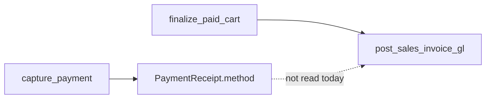
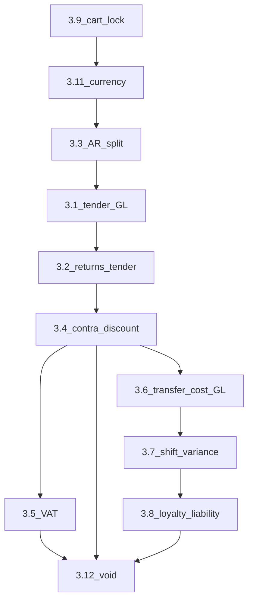

# GL / POS data-flow audit (Phases 1–2)

## Phase 1 — Status report

| Issue | Status | Evidence (current code) |
|-------|--------|-------------------------|
| **3.1** Card payments posted to Cash on Hand | **[B] Still exists** | [`post_sales_invoice_gl`](app/services/document_posting_service.py) debits `default_cash_account_id` for all walk-in sales (`invoice.customer_id is None`) with memo `"POS cash sale"` (lines 47–64). Tender `cash` / `card` / `other` is captured in [`capture_payment`](app/services/payment_service.py) on `PaymentReceipt.method` (lines 99–108) but **is never read** when building GL lines. |
| **3.2** Sales returns always credit cash | **[B] Still exists** | [`post_sales_return_gl`](app/services/document_posting_service.py) always credits `default_cash_account_id` for the refund side (lines 202–216). [`returns_service.create_return_and_credit`](app/services/returns_service.py) calls this with no tender from the original invoice. |
| **3.3** Account-customer sales: AR + immediate cash receipt | **[B] Still exists** | Same function posts accrual then **unconditionally** posts `sales_invoice:{id}:cash` Dr Cash / Cr AR ([`document_posting_service.py`](app/services/document_posting_service.py) lines 95–146). No branch for “open AR only.” |
| **3.4** Discounts netted into revenue | **[B] Still exists** | Cart stores `subtotal`, `discount_total`, `total` ([`cart_service._recalc_totals`](app/services/cart_service.py) lines 60–69). GL credits **only** `default_sales_revenue_account_id` for `q2(invoice.total)` ([`document_posting_service.py`](app/services/document_posting_service.py) lines 29–31, 57–62, 105–110). [`AccountingSettings`](app/models/accounting_settings.py) has **no** default sales-discount / contra-revenue account. |
| **3.5** No tax / VAT engine | **[B] Still exists** | No `tax_*` fields on [`SalesInvoice`](app/models/sales_invoice.py) / [`PosCart`](app/models/pos_cart.py). No tax lines in [`post_sales_invoice_gl`](app/services/document_posting_service.py). Tax only appears in OCR path ([`invoice_scan_service.py`](app/services/invoice_scan_service.py) scan parsing), not in POS sale GL. |
| **3.6** Inter-branch transfers: stock without cost / GL | **[B] Still exists** | [`transfer_service.dispatch_batch` / `receive_batch`](app/services/transfer_service.py) (lines 71–122) only call [`apply_stock_movement`](app/services/inventory_service.py). **No** `post_journal_entry`, **no** `inventory_valuation_service` / `BranchProductCost` updates for the transfer leg—so inventory **quantity** moves but there is no in-books inventory reclassification between branches and destination **WAVG** is not updated from the source branch’s cost. |
| **3.7** Shift cash variance not posted to GL | **[B] Still exists** | [`close_shift`](app/services/shift_service.py) (lines 112–137) sets `variance`, persists `ZReport` JSON payload—**no** call to [`post_journal_entry`](app/services/accounting_service.py) or `document_posting_service`. |
| **3.8** Loyalty: no BS liability | **[B] Still exists** | [`loyalty_service.py`](app/services/loyalty_service.py) is an append-only points ledger only; **no** imports from `accounting_service` / `document_posting_service`. Documented gap in [`PROJECT_STATE.md`](PROJECT_STATE.md) (“Loyalty vs GL”). |
| **3.9** Cart lock optional before finalize | **[B] Still exists** | [`finalize_paid_cart`](app/services/invoice_service.py) allows `cart.status in {"active", "checkout_locked"}` (lines 36–37). [`create_payment_intent`](app/services/payment_service.py) also allows both (lines 33–34). Lock is only required if the client chooses [`change_state` … `"lock"`](app/services/cart_service.py) (lines 20–33, 145–164). |
| **3.11** Payment intent currency free text | **[B] Still exists** | [`create_payment_intent`](app/services/payment_service.py) takes `currency: str` and stores it unchanged (lines 26–44). Schema [`PaymentIntentCreateRequest`](app/schemas/pos_payment.py) uses `currency: str = "USD"` (lines 11–14) with **no** validation against [`currencies`](app/models/) or ISO list. ORM: [`PaymentIntent.currency`](app/models/pos_payment.py) `String(8)` (line 25). |
| **3.12** No void invoice path | **[B] Still exists** | Sales API is finalize-only: [`app/api/v1/sales.py`](app/api/v1/sales.py) (`POST /pos/sales/finalize`, lines 16–40). Repository search shows **no** void/cancel invoice workflow for same-day reversal before return. |

**Note:** Issue **3.10** (goods receipt vs PO cost) was not in your target list; the review text at [`SYSTEM_REVIEW.md`](SYSTEM_REVIEW.md) §3.10 still describes a plausible gap if you want it tracked separately.

---

## Phase 2 — Root cause and architectural direction (issues still open)

### 3.1 Card → Cash on Hand

- **Root cause:** GL posting is keyed only on `SalesInvoice.customer_id` (walk-in vs account), not on **settlement instrument**. `PaymentReceipt.method` is written at capture time but is outside the `post_sales_invoice_gl` contract.
- **Architectural solution:** Extend the posting contract with **deterministic** inputs: e.g. resolve tender from `PaymentReceipt` (or `InvoicePayment` once corrected) and map `method` → chart accounts (`Cash`, `Card clearing`, `Other clearing`). Post sale as Dr clearing / Cr revenue (+ COGS as today). Keep PSP settlement as a **separate** deterministic journal (Dr Bank / Cr Card clearing) when bank feed or settlement import runs—never infer card from floats.

### 3.2 Returns always credit cash

- **Root cause:** `post_sales_return_gl` hard-codes the credit to `default_cash_account_id`; refund path does not read original sale tender or clearing balances.
- **Architectural solution:** Persist **tender snapshot** on `SalesInvoice` / line-level payments at sale time; on return, mirror the original entry classes (Dr revenue, Cr same clearing/cash as original). For partial multi-tender sales, allocate refund by application rules (FIFO by tender) in pure business logic.

### 3.3 AR + spurious cash receipt

- **Root cause:** `post_sales_invoice_gl` bundles “accrual” and “cash receipt” for every `customer_id` sale, conflating **revenue recognition + AR** with **cash collection**.
- **Architectural solution:** Post **only** Dr AR / Cr revenue (+ COGS) at invoice for true credit terms. Post Dr Cash / Cr AR only when payment is recorded—either via `apply_ar_payment` extended to emit GL, or a dedicated `post_ar_cash_receipt_gl` called from the payment application path with idempotency keys tied to `ArPaymentApplication.id`.

### 3.4 Discounts netted in revenue

- **Root cause:** Commercial truth is split across `subtotal` / `discount_total` / `total`, but GL collapses to a single revenue credit on `total`.
- **Architectural solution:** Add `default_sales_discount_account_id` (contra-revenue). Post Dr Cash/AR for `total`, Cr revenue for `subtotal` (or list prices), Cr sales discounts for `discount_total`, with rounding line if needed—still one balanced batch per document.

### 3.5 No tax / VAT engine

- **Root cause:** No tax dimensions on products, lines, or settings; no output tax liability account; journals never split net vs tax.
- **Architectural solution:** Introduce a **deterministic** tax engine: tax category on product or line, rate snapshot on invoice line, `tax_payable` GL account, and posting pattern Dr Cash/AR (gross), Cr revenue (net), Cr VAT payable (tax)—jurisdiction rules as data + code tables, not LLM.

### 3.6 Inter-branch transfer without cost / GL

- **Root cause:** Transfer is modeled as **two stock movements** only; inventory subledger in GL is not branch-intercompany aware; `BranchProductCost` is not adjusted for units moved at source WAVG.
- **Architectural solution:** (1) At receive (or dispatch, pick one convention): GL **Dr Inventory @ destination / Cr Inventory @ source** at source WAVG × qty. (2) Update destination `BranchProductCost` using the same unit economic cost so downstream COGS stays aligned. Optionally use a transit/clearing account between dispatch and receive if controls require it.

### 3.7 Shift variance not in GL

- **Root cause:** Operational close writes analytics (`ZReport`) but no accounting event.
- **Architectural solution:** On `close_shift`, if `variance != 0`, post Dr/Cr `Cash over/short` (expense) vs `default_cash_account_id` with idempotency `pos_shift:{id}:variance`, keyed to branch and open period—pure function of declared vs expected.

### 3.8 Loyalty without liability

- **Root cause:** Loyalty is a **parallel subledger** (points) with no link to `JournalEntry`.
- **Architectural solution:** Define points **liability rate** (currency per point or fair value). On accrual: Dr discount expense or Dr loyalty expense / Cr loyalty liability. On redemption: Dr liability / Cr revenue (breakage policy explicit). Manual adjustments mirror `adjust_points`.

### 3.9 Optional cart lock

- **Root cause:** State machine allows payment and finalize from `active`, so cart lines and totals can race with payment.
- **Architectural solution:** Require `checkout_locked` before `create_payment_intent` and before `finalize_paid_cart` (or auto-lock on first intent). Deterministic rule: no line mutations unless `status == active`.

### 3.11 Currency free text

- **Root cause:** API accepts arbitrary string; no link to base currency or FX.
- **Architectural solution:** Validate `currency` against `currencies.code` (or strict ISO enum). Store `amount` + `currency_id`; if cart currency ≠ intent currency, require **FX rate snapshot** and post in functional currency via translation accounts—no silent string.

### 3.12 No void invoice

- **Root cause:** Only immutable forward flow (finalize) and returns exist; no same-day reversal with strict guards.
- **Architectural solution:** Add `void_invoice` with preconditions: same fiscal period, within time window, no downstream return, reverse stock + **reversing journal** (reuse `reverses_entry_id` pattern from [`accounting_governance_service`](app/services/accounting_governance_service.py)) with new idempotency keys—fully deterministic eligibility checks.

---

## Suggested workflow diagram (payment vs GL gap)

---

## Phase 3 — Dependency-ordered execution plan

**Rules:** One **issue** (3.x) per commit unless you explicitly allow a split; touch [`document_posting_service.py`](app/services/document_posting_service.py) in **strict serial order** (3.3 → 3.1 → 3.2 → 3.4) to avoid conflicting edits. **Milestone 1, Issue 1** is **3.9** (first executable slice).

### Milestone 1 — POS state machine and payment contract (foundational)

| Order | Issue | Target files (primary) | Dependency reason |
|-------|-------|-------------------------|-------------------|
| **1** | **3.9 Cart lock required before finalize / intent** | [`app/services/invoice_service.py`](app/services/invoice_service.py), [`app/services/payment_service.py`](app/services/payment_service.py), [`app/services/cart_service.py`](app/services/cart_service.py) (if transitions need tightening), [`app/api/v1/carts.py`](app/api/v1/carts.py) / [`app/api/v1/payments.py`](app/api/v1/payments.py) if validation belongs at HTTP edge, [`tests/`](tests/) covering finalize and intents | **Must be first:** Without a hard `checkout_locked` gate, cart lines and totals can still change after intent creation or during capture. Any later “snapshot” of tender, tax, or discounts for GL becomes **non-deterministic**. This unlocks safe assumptions for all payment and posting work. |
| **2** | **3.11 Payment intent currency validated** | [`app/schemas/pos_payment.py`](app/schemas/pos_payment.py), [`app/services/payment_service.py`](app/services/payment_service.py), [`app/models/pos_payment.py`](app/models/pos_payment.py) (only if schema/storage changes), [`app/models/currencies.py`](app/models/currencies.py) + DB lookup helper (or small service), [`tests/`](tests/) | **Before multi-line GL and VAT:** Currency must be a **controlled vocabulary** (FK or strict enum) tied to the existing `currencies` table so amounts are not posted under meaningless codes. Unlocks consistent validation for 3.5 (FX/tax in functional currency later) and avoids garbage `PaymentIntent` rows that downstream GL would trust. |

### Milestone 2 — Core GL separations (same subsystem: invoice → journal)

| Order | Issue | Target files (primary) | Dependency reason |
|-------|-------|-------------------------|-------------------|
| **3** | **3.3 Account-customer: AR accrual only; cash receipt when paid** | [`app/services/document_posting_service.py`](app/services/document_posting_service.py), [`app/services/subledger_service.py`](app/services/subledger_service.py) and/or new small `ar_gl_service` helper, [`app/api/v1/accounting.py`](app/api/v1/accounting.py) (where `apply_ar_payment` is exposed), [`app/services/invoice_service.py`](app/services/invoice_service.py) only if AR open item creation must align with invoice finalize), [`tests/`](tests/) | **Before 3.1/3.2:** Removes the bogus **Dr Cash / Cr AR** leg from the invoice event so AR and subledger **age correctly**. Subsequent tender work (3.1) only affects walk-in / clearing paths without fighting a second, wrong cash story on credit sales. Cash receipt GL must bind to **payment application** idempotency (e.g. `ArPaymentApplication.id`). |
| **4** | **3.1 Card vs cash vs other → correct clearing / cash** | [`app/services/document_posting_service.py`](app/services/document_posting_service.py), [`app/services/invoice_service.py`](app/services/invoice_service.py) (persist tender snapshot or fix `InvoicePayment` linkage), [`app/models/sales_invoice.py`](app/models/sales_invoice.py) / [`alembic/versions/`](alembic/versions/) if new columns, [`app/models/accounting_settings.py`](app/models/accounting_settings.py) + [`app/services/seed_service.py`](app/services/seed_service.py) + migration for `default_card_clearing_account_id` (and optional `other`), [`tests/`](tests/) | **After 3.9 and 3.3:** Needs a **stable** checkout and correct AR story; needs **settings + persistence** so GL is not inferred from free-text. Unlocks 3.2 (returns must credit the **same** clearing/cash account as the original sale). |
| **5** | **3.2 Sales returns mirror original tender** | [`app/services/document_posting_service.py`](app/services/document_posting_service.py), [`app/services/returns_service.py`](app/services/returns_service.py) (pass tender / allocation into GL), [`app/models/sales_return.py`](app/models/sales_return.py) only if return header must store refund tender), [`tests/`](tests/) | **After 3.1:** Return posting must read the **same tender snapshot** (or allocation rules) introduced for sales; otherwise card refunds still hit cash. |
| **6** | **3.4 Discounts as contra-revenue** | [`app/services/document_posting_service.py`](app/services/document_posting_service.py), [`app/models/accounting_settings.py`](app/models/accounting_settings.py) + seed + migration for `default_sales_discount_account_id`, [`tests/`](tests/) | **After walk-in tender split (3.1):** Dr bank/clearing must still equal **gross** settlement; revenue and contra-revenue split uses existing `subtotal` / `discount_total` / `total` on [`SalesInvoice`](app/models/sales_invoice.py). Doing this **after** 3.1 avoids reworking the same debit line twice. |

### Milestone 3 — Tax / VAT engine (data model + posting)

| Order | Issue | Target files (primary) | Dependency reason |
|-------|-------|-------------------------|-------------------|
| **7** | **3.5 No tax / VAT engine** | [`app/models/sales_invoice.py`](app/models/sales_invoice.py), [`app/models/sales_invoice.py`](app/models/sales_invoice.py) (`SalesInvoiceLine`), [`app/models/product.py`](app/models/product.py) / tax tables as designed, [`app/services/cart_service.py`](app/services/cart_service.py) + [`app/models/pos_cart.py`](app/models/pos_cart.py) if tax at POS, [`app/services/document_posting_service.py`](app/services/document_posting_service.py), [`app/models/accounting_settings.py`](app/models/accounting_settings.py) + seed + migration (`default_output_tax_payable_account_id` or similar), [`app/schemas/`](app/schemas/), [`tests/`](tests/) | **After 3.4:** Gross vs net vs tax lines on the **income statement** should sit on top of the finalized revenue/discount shape. VAT also interacts with **tender** (cash/card clears gross). May legitimately require **multiple commits** (schema → POS calc → GL) if you want smaller diffs—still one *issue* 3.5, coordinated. |

### Milestone 4 — Inventory cost alignment (branch economics)

| Order | Issue | Target files (primary) | Dependency reason |
|-------|-------|-------------------------|-------------------|
| **8** | **3.6 Inter-branch transfers: stock + cost + GL** | [`app/services/transfer_service.py`](app/services/transfer_service.py), [`app/services/inventory_valuation_service.py`](app/services/inventory_valuation_service.py), [`app/models/branch_product_costs.py`](app/models/branch_product_costs.py) usage, new or extended helper in [`app/services/document_posting_service.py`](app/services/document_posting_service.py) (inter-branch inventory journal), [`app/models/accounting_settings.py`](app/models/accounting_settings.py) + seed if a transit/clearing account is required, [`tests/`](tests/) | **Largely independent of 3.5–3.4** once sales GL is stable, but should follow **core sales/returns** work so COGS and revenue testing baselines are settled. Updates **deterministic** cost carry (WAVG at source) + balanced inter-branch inventory GL. |

### Milestone 5 — Operational subledgers (cash desk + loyalty)

| Order | Issue | Target files (primary) | Dependency reason |
|-------|-------|-------------------------|-------------------|
| **9** | **3.7 Shift cash variance posted to GL** | [`app/services/shift_service.py`](app/services/shift_service.py), [`app/services/document_posting_service.py`](app/services/document_posting_service.py) or thin wrapper calling [`post_journal_entry`](app/services/accounting_service.py), [`app/models/accounting_settings.py`](app/models/accounting_settings.py) + seed + migration (`default_cash_over_short_account_id`), [`tests/`](tests/) | **After cash semantics (3.1, 3.3):** Variance is a **cash over/short** event against the same cash account used in POS postings; defining it before tender separation would risk inconsistent account mapping. |
| **10** | **3.8 Loyalty points → balance-sheet liability** | [`app/services/loyalty_service.py`](app/services/loyalty_service.py), hook from accrual/redemption callers (e.g. invoice finalize / returns if points are earned there—grep usages), [`app/models/accounting_settings.py`](app/models/accounting_settings.py) + seed + migration (`default_loyalty_liability_account_id`, expense account if needed), [`app/services/document_posting_service.py`](app/services/document_posting_service.py) or dedicated `loyalty_gl_service`, [`PROJECT_STATE.md`](PROJECT_STATE.md) if you track completion, [`tests/`](tests/) | **After discount/tax architecture where relevant:** Accrual economics often tie to **promotions** (discount) and **deferred revenue**; GL accounts must exist. Can run after 3.7 in parallel theory, but ordered here to keep **cash** milestones contiguous. |

### Milestone 6 — Document lifecycle (reversals)

| Order | Issue | Target files (primary) | Dependency reason |
|-------|-------|-------------------------|-------------------|
| **11** | **3.12 Void invoice path** | [`app/api/v1/sales.py`](app/api/v1/sales.py), [`app/schemas/sales_invoice.py`](app/schemas/sales_invoice.py), [`app/services/invoice_service.py`](app/services/invoice_service.py), [`app/services/inventory_service.py`](app/services/inventory_service.py) (stock reversal), [`app/services/document_posting_service.py`](app/services/document_posting_service.py) or [`app/services/accounting_governance_service.py`](app/services/accounting_governance_service.py) (reversal pattern), [`app/models/sales_invoice.py`](app/models/sales_invoice.py) (status / void metadata) + migration, [`tests/`](tests/) | **Must be last among targeted issues:** Void must **reverse** the same GL patterns as 3.1–3.4 (and tax once 3.5 exists), unwind stock, and respect **AR** if 3.3 created open items. Doing void earlier would require duplicate reverse logic for obsolete posting shapes. |

### Dependency graph (high level)

---

## Phase 3 execution gate

Fix **one issue (3.x) per commit** in the table order above. **No code** until you explicitly authorize **Milestone 1, Issue 1 (3.9)**.
