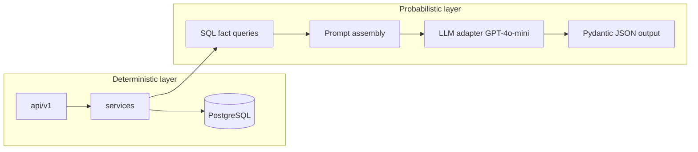

# MEZAN Epics 7–11 — Architectural Roadmap

## Context summary

- **Completed work** is documented in [`PROJECT_STATE.md`](PROJECT_STATE.md): Identity, catalog/PO/transfers, POS with mock payments, HR/payroll, double-entry GL with mandatory `branch_id` on lines, CRM/discounts.
- **Architecture rule**: [`api/v1/`](app/api/v1/) = HTTP + validation + DI only; [`services/`](app/services/) = business rules; [`models/`](app/models/) = ORM; [`schemas/`](app/schemas/) = Pydantic ([`.cursor/rules/01-project-context.mdc`](.cursor/rules/01-project-context.mdc)).
- **Existing integration points**: Invoice OCR pipeline in [`app/services/invoice_scan_service.py`](app/services/invoice_scan_service.py) with [`FakeOcrProvider`](app/services/ocr/providers/fake.py); POS payments via [`app/services/payment_service.py`](app/services/payment_service.py) and [`MockPaymentProvider`](app/services/payments/providers/mock.py).

## Actor coverage (mapped to epics)

| Actor | Primary epics |
|-------|-----------------|
| Owner | 7 (policy), 10 (reports/close), 11 (BI/AI consumption); **PDF export is frontend** |
| Accountant | 10 (CoA global, trial balance, period close, reversals, AR/AP) |
| IT Admin | 7 (users, fixed roles, overrides, audit) |
| HR Manager | 7 (onboarding queue, contracts/salary completion) |
| Cashier | 9 (payment method capture), 3 (existing POS flows) |
| Warehouse Manager / Floor Staff | 8 (invoice ingest), 2 (existing catalog/receipts) |
| Marketing | 11 (AI suggestions from deterministic facts) |

## Cross-cutting principle: deterministic vs probabilistic

- **Rule**: No LLM calls inside posting, inventory valuation, payroll, or payment settlement. LLM only in a dedicated advisory path (Epic 11) after numeric facts are computed in SQL.

---

## Epic 7 — Identity lifecycle, base roles, and security hardening

**Goal**: Close the IT→HR hand-off gap, replace ad-hoc roles with a **fixed base role catalog + optional permission overrides**, and add **session policy** and **password reset**.

### User stories (BABOK-style)

1. **As an** IT Admin, **I want** to create a user account that enters a `PENDING_ONBOARDING` state **so that** HR is notified and can complete employment data before the user is fully activated.
2. **As an** HR Manager, **I want** a work queue of pending users **so that** I can attach contract dates, job title, and salary band without IT re-entering data.
3. **As an** IT Admin, **I want** to assign fixed base roles (Owner, Accountant, Cashier, …) with optional per-user or per-branch permission overrides **so that** governance is consistent but flexible.
4. **As a** system, **I want** access tokens to expire and optionally refresh within policy **so that** idle sessions time out (session timeout).
5. **As a** user, **I want** to request a password reset and set a new password via a secure token **so that** I can recover access without admin intervention.

### Technical implementation (FastAPI / SQLAlchemy)

- **Schema (Alembic)**:
  - `users.lifecycle_status` enum: e.g. `PENDING_ONBOARDING`, `ACTIVE`, `SUSPENDED` (migrate from current status if needed).
  - `onboarding_tasks` or extend `employees` link: FK `user_id`, HR-owned fields, completion timestamps.
  - `roles`: add `is_system` / `code` (immutable codes: `OWNER`, `ACCOUNTANT`, …); seed migration.
  - `role_permission_overrides` (optional): `user_id`, `permission_key`, `effect` (allow/deny), `branch_id` nullable—**evaluate after base role** for least-surprise semantics (document in service layer).
  - `password_reset_tokens`: hashed token, expiry, single-use, user FK.
- **Services**: `user_lifecycle_service`, `role_catalog_service`, `auth_session_service` (token TTL/refresh), `password_reset_service`.
- **API** (`api/v1/`): admin endpoints for create user + trigger onboarding; HR endpoints for queue + complete onboarding; auth endpoints for forgot/reset password; settings read for session TTL (non-secret).

### Frontend vs backend

| Backend | Frontend |
|--------|----------|
| All state transitions, tokens, RBAC evaluation | Admin: user creation wizard, role picker with fixed labels, override matrix UI |
| Audit logs (existing pattern) | HR: onboarding inbox, forms for contract/salary |
| Password reset API | Login: forgot password, reset page with token from email/SMS link |
| Executive KPI JSON (existing `/api/v1/bi/executive-kpis`) | **Owner: PDF export** — generate PDF in browser or server-side PDF service calling same APIs; **not** a FastAPI gap if product uses client-side PDF |

---

## Epic 8 — Production OCR and deterministic invoice normalization

**Goal**: Replace [`FakeOcrProvider`](app/services/ocr/providers/fake.py) with **real image/QR processing** and implement **`parse_extracted_invoice`** to output a stable normalized dict for [`InvoiceScan`](app/models/invoice_scan.py) review and goods receipt posting.

### User stories

1. **As a** Warehouse Manager, **I want** to photograph or upload a supplier invoice **so that** line items and totals are pre-filled for validation.
2. **As a** Warehouse Manager, **I want** low-confidence fields flagged **so that** I correct them before posting.
3. **As a** system, **I want** OCR to run behind a pluggable provider interface **so that** we can swap Tesseract vs cloud OCR without changing posting logic.

### Technical implementation

- **Providers**: New `ImageOcrProvider` (preprocess image bytes → text/regions); optional second provider for QR decoding when `source_type=qr`.
- **Contract**: Keep [`OcrProvider` protocol](app/services/ocr/providers/base.py); add `extract_invoice` overload or separate method for binary payloads if `data: str` is insufficient—migrate to `bytes` + content-type in schema/service **without** putting ML in `document_posting_service`.
- **`parse_extracted_invoice`**: Pure Python mapping from `ExtractedInvoice.payload` to canonical keys: vendor, invoice_no, dates, lines[], tax, total; validate with Pydantic schema in `schemas/`.
- **Config**: Environment flags for provider selection, language packs, DPI limits.

### Frontend vs backend

| Backend | Frontend |
|--------|----------|
| Upload endpoint, store `raw_output`, normalized `parsed_output`, status transitions | Camera/upload UI, side-by-side image vs editable fields |
| Confidence scores per field (if provider supplies) | Highlight low-confidence cells |

---

## Epic 9 — Reliable in-store payment recording (no external gateway)

**Goal**: Satisfy the business rule: **no card processor**—only **authoritative recording** of method (Cash, Card, etc.), amounts, idempotency, and receipts—replacing reliance on [`MockPaymentProvider`](app/services/payments/providers/mock.py) behavior as the “fake external API.”

### User stories

1. **As a** Cashier, **I want** to record Cash vs Card (and optional reference like auth code) **so that** shifts reconcile without calling Stripe.
2. **As an** Accountant, **I want** payment receipts tied to POS sales with immutable audit trail **so that** GL cash/bank movements remain traceable.
3. **As a** system, **I want** idempotent capture **so that** double-taps do not double-post.

### Technical implementation

- **New provider** e.g. `InStoreLedgerProvider`: `create_intent` returns a stable internal reservation ID; `capture` succeeds synchronously and does **not** call HTTP—only validates amount/currency and records `PaymentReceipt` (existing pattern in [`capture_payment`](app/services/payment_service.py)).
- **Enums**: Strict `method` union in Pydantic (`cash`, `card`, `other`) + optional `card_last4` / receipt reference fields—**no PAN storage** (PCI minimization).
- **Default provider** in config: `in_store` instead of `mock` for non-dev environments; keep `mock` for automated tests.

### Frontend vs backend

| Backend | Frontend |
|--------|----------|
| Intent + capture APIs, receipt payload | Payment method selector, reference fields, print/email receipt |
| Reconciliation listing endpoints (optional) | Z-report / shift close UI integration |

---

## Epic 10 — Fiscal periods, reversals, AR/AP subledgers, global CoA

**Goal**: Address **period close**, **reversal pattern**, **AR/AP open items**, and clarify **Chart of Accounts as global** with **`branch_id` as analytic dimension** on journals (and reporting), per your architecture note.

### User stories

1. **As an** Accountant, **I want** to close a fiscal period **so that** no new journals post to closed periods.
2. **As an** Accountant, **I want** to post reversing entries linked to an original journal **so that** corrections are auditable.
3. **As an** Accountant, **I want** AR and AP open-item lists with aging **so that** I can reconcile customers and suppliers.
4. **As an** Accountant, **I want** a single global Chart of Accounts **so that** trial balance and statements are comparable across branches with branch filters.

### Technical implementation

- **Schema**:
  - `fiscal_periods`: `company_id` or global, `year`, `month`, `status` (`open`/`closed`), `closed_at`, `closed_by`.
  - `journal_entries`: add `reverses_entry_id` nullable FK; optional `period_id` FK for fast lock checks.
  - **Posting guard**: In [`accounting_service.post_journal_entry`](app/services/accounting_service.py) (or equivalent), reject if `entry_date` falls in a closed period.
  - **AR/AP**: `ar_open_items` / `ap_open_items` (source doc, amount_open, due_date, counterparty); `payment_applications` allocating receipts/disbursements to open items; expose aging via SQL views or service queries.
  - **CoA**: Ensure `accounts` table has **no** `branch_id` (global); **lines** keep `branch_id` as dimension ([`PROJECT_STATE.md`](PROJECT_STATE.md) already notes mandatory `branch_id` on lines)—add migration to drop branch from account if mistakenly present, and document reporting filters.
- **API**: Period close/reopen (Owner/Accountant), reversal endpoint, AR/AP aging and open-item CRUD tied to existing sales/purchase flows where applicable.

### Frontend vs backend

| Backend | Frontend |
|--------|----------|
| Period calendar, close/reopen, reversal posting | Period management UI, confirmation modals |
| AR/AP aging JSON | Aging tables, drill-down to invoices |
| Trial balance / GL (existing) with branch filter | Accountant dashboards; **Owner PDF** can include TB snapshots |

**Optional follow-up** (from [`PROJECT_STATE.md`](PROJECT_STATE.md) gaps): Loyalty liability GL posting—defer unless scoped; if included, add as **one story** under Epic 10 with a liability account and periodic accrual.

---

## Epic 11 — AI advisory service (Marketing) and automated database backups

**Goal**: Implement the **AI-Advisory workflow** (deterministic SQL → prompt → **GPT-4o-mini** → parsed JSON) for Marketing; add **scheduled `pg_dump`** with retention (local/S3).

### User stories (Marketing + Ops)

1. **As a** Marketing Manager, **I want** ranked suggestions (e.g. bundles, expiring stock promotions) **so that** I can plan campaigns.
2. **As a** system, **I want** suggestions grounded in queried sales and inventory facts **so that** outputs are explainable and safe.
3. **As an** Owner/IT Admin, **I want** automated nightly database backups **so that** restores are possible from portable files.

### Technical implementation — AI

- **New package** e.g. `app/services/marketing_advisory/`:
  - `fact_queries.py`: parameterized SQL (expiring batches, co-occurrence in `sales_lines`, slow movers)—**no** LLM.
  - `prompt_builder.py`: builds system + user messages from facts + guardrails (“JSON only”, schema).
  - `llm_client.py`: OpenAI-compatible client, model `gpt-4o-mini`, timeouts, max tokens.
  - `suggestion_schema.py` (Pydantic): strict output validation; on failure, return error or empty with log.
- **API**: `POST /api/v1/marketing/advisory/suggestions` with scope filters; permission `marketing_advisory.run`. **No** LLM in other routers.
- **Secrets**: API keys via environment / secret manager; never logged.

### Technical implementation — backups

- **Worker**: Celery beat, or systemd/cron invoking a small CLI script in repo `scripts/backup_db.sh` (Docker-friendly).
- **Behavior**: `pg_dump` (custom `-Fc` or plain SQL per ops preference), filename with timestamp, rotate N days, optional `aws s3 cp` if `S3_BUCKET` set.
- **API (optional)**: `GET /api/v1/admin/backups/status` reading a heartbeat file—read-only.

### Frontend vs backend

| Backend | Frontend |
|--------|----------|
| Advisory endpoint + structured JSON | Marketing dashboard: cards for suggestions, “why” from returned fact snippets |
| Backup job (off-request path) | Admin ops page: last backup time, link to runbook restore |

---

## Suggested sequencing

1. **Epic 7** — Unblocks org workflows and secures auth policies.
2. **Epic 9** — Low risk, removes “mock” dependency for production POS recording.
3. **Epic 8** — Depends on stable invoice models; can parallelize with 9 if teams split.
4. **Epic 10** — Highest accounting risk; requires careful migration and regression on [`document_posting_service`](app/services/document_posting_service.py).
5. **Epic 11** — Isolated; enable after secrets management is ready.

## Out of scope for Epics 7–11 (IEEE/BABOK traceability)

- **SSO/OIDC** — Listed in [`PROJECT_STATE.md`](PROJECT_STATE.md) as future; Epic 7 can leave extension hooks in auth.
- **FIFO/LIFO, multi-currency, cash flow statement** — Remain backlog unless you expand Epic 10 scope.

## Documentation deliverable

- After implementation, update [`PROJECT_STATE.md`](PROJECT_STATE.md) with new epics and shrink the **Gaps** table for resolved rows (per project rules).
