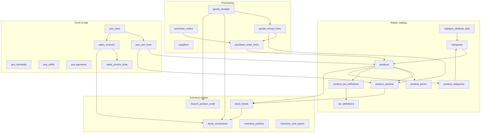
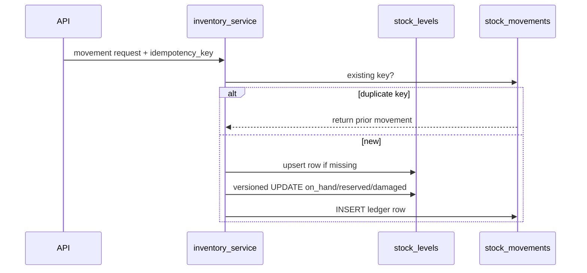
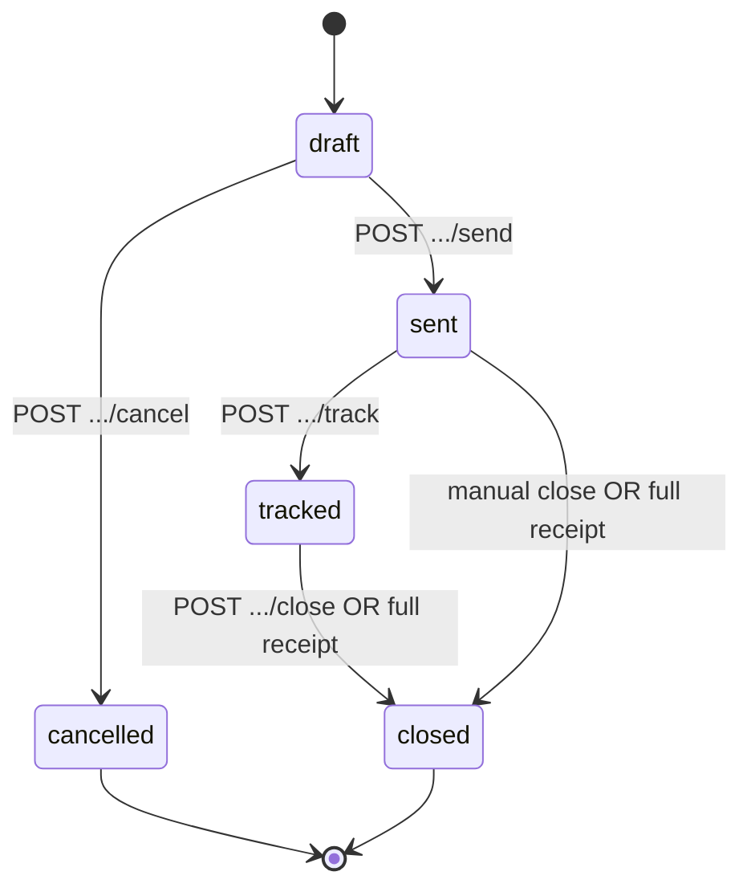
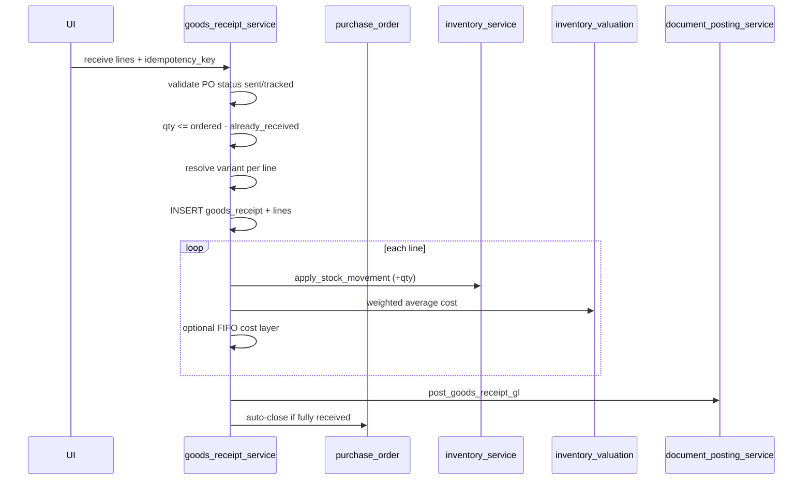

# Mezan: Categories, Products, Inventory, Purchase Orders, and POS Impact

Technical reference for how the **master catalog**, **stock engine**, **purchasing pipeline**, and **point of sale (POS)** connect in Mezan. Describes database tables, keys, relationships, backend orchestration, and web UI flows.

**Code layout (enforced):**

| Layer | Path | Responsibility |
|-------|------|----------------|
| HTTP | `app/api/v1/` | Validation, RBAC, response shaping |
| Business | `app/services/` | Rules, transactions, posting |
| ORM | `app/models/` | Table definitions |
| Contracts | `app/schemas/` | Pydantic DTOs |
| Web | `web/src/features/{catalog,inventory,purchasing,pos}/` | Screens + React Query |

---

## 1. Domain overview



**Central idea:** A **product** is the merchandising and tax record; a **product variant** is the stock-keeping unit (SKU/barcode). All quantity tracking (`stock_levels`, movements, PO receipts, POS sales) is **per branch + product + variant**. Categories shape **dynamic attributes** and navigation; they do not hold stock.

---

## 2. Database tables (names, columns, keys)

### 2.1 `categories`

Hierarchical product taxonomy (adjacency list via `parent_id`).

| Column | Type | Notes |
|--------|------|-------|
| `id` | PK | |
| `parent_id` | FK → `categories.id` | `ON DELETE SET NULL`; root has `NULL` |
| `name` | string | Unique per parent: `uq_categories_parent_name` |
| `slug` | string | Indexed |
| `image_url` | string, nullable | |
| `sort_order` | int | Display order among siblings |
| `is_active` | bool | Inactive nodes hidden in many UIs |
| `created_at`, `updated_at` | timestamptz | |

**Relationships:** `parent` / `children` (self), `attribute_defs`, `products` (primary `products.category_id`), `product_tag_links` via `product_categories`.

---

### 2.2 `category_attribute_defs`

Schema of dynamic fields for products in a category (and inherited from ancestors).

| Column | Type | Notes |
|--------|------|-------|
| `id` | PK | |
| `category_id` | FK → `categories.id` | `ON DELETE CASCADE` |
| `inherited_from_category_id` | FK → `categories.id`, nullable | Set when row was propagated from an ancestor |
| `key` | string | Unique per category: `uq_cat_attr_defs_category_key` |
| `label` | string | UI label |
| `type` | string | `text`, `int`, `float`, `bool`, `date`, … |
| `required` | bool | |
| `options` | JSONB, nullable | e.g. select options |
| `validation` | JSONB, nullable | min/max, regex, etc. |
| `sort_order` | int | |
| `created_at`, `updated_at` | timestamptz | |

**Usage:** Product values live in `products.attributes` (JSONB), validated against merged defs for the product’s primary category.

---

### 2.3 `products`

Master catalog row (one sellable concept).

| Column | Type | Notes |
|--------|------|-------|
| `id` | PK | |
| `category_id` | FK → `categories.id` | `ON DELETE RESTRICT` — **primary** category |
| `name` | string | Indexed |
| `image_url` | string, nullable | |
| `sku` | string | **Unique** globally |
| `barcode` | string, nullable | **Unique** when set; auto EAN-13 internal code if empty on create |
| `status` | string | `active` \| `archived` |
| `attributes` | JSONB | Category-driven fields; may include compat key `price` |
| `standard_cost` | Numeric(14,4), nullable | Fallback cost when no branch average |
| `output_vat_rate` | Numeric(8,4) | Decimal fraction (0.15 = 15%); legacy/product-level rate |
| `created_at`, `updated_at` | timestamptz | |

**Relationships:** `variants`, `category_links` (`product_categories`), `tax_definition_links`, `category`.

**On create (`catalog_service.create_product`):** Auto SKU `PRD-{id}`, optional internal barcode, default `ProductVariant`, `product_prices` row if `sell_price` provided, tax links synced.

---

### 2.4 `product_variants`

Stock-keeping entity (color/size/SKU). **Inventory and POS lines reference variants.**

| Column | Type | Notes |
|--------|------|-------|
| `id` | PK | |
| `product_id` | FK → `products.id` | `ON DELETE RESTRICT` |
| `sku` | string | Unique (`uq_product_variants_sku`) |
| `barcode` | string, nullable | Unique when set |
| `attribute_values` | JSONB | e.g. `{"color":"red","size":"M"}` |
| `active` | bool | |
| `created_at`, `updated_at` | timestamptz | |

**Default variant:** `resolve_default_variant_id()` picks lowest `id` among active variants (cached per request).

**Relational variant axes (source of truth):**

| Table | Purpose |
|-------|---------|
| `attributes` | Global axes: `code`, `name`, `sort_order` |
| `attribute_values` | Normalized values per axis (`code`, `label`, optional `metadata` e.g. hex) |
| `product_variant_attributes` | Pivot `(variant_id, attribute_id, attribute_value_id)` — unique one value per axis per variant |

`category_attribute_defs.attribute_id` + `use_for_variants` link a category field to a catalog axis for Cartesian generation.

**Generator APIs:**

- `POST /api/v1/products/{id}/variants/preview-generate` — body `{ "axes": { "<attribute_id>": [<value_id>, ...] } }`
- `POST /api/v1/products/{id}/variants/sync` — persist variants + pivot rows
- `GET /api/v1/catalog/attributes` — master data; `GET .../attributes/{id}/values` for pickers

`product_variants.attribute_values` JSONB is synced from the pivot for legacy readers. Backfill: `uv run python -m app.scripts.backfill_variant_attribute_pivot`.

**Web UX path (attributes & variants):**

1. **Admin → Product attributes (catalog dictionary)** (`/admin/catalog-attributes`) — maintenance screen for global axes and values (merge duplicates, audit codes). Day-to-day creation uses creatable pickers on the product form.
2. **Catalog → Products → New/Edit** — tab **Product data** (name, tax, categories, image, status); tab **Attributes** — Odoo-style rows (attribute → values for this product only). On **create**, variants grid is hidden; a summary shows how many variants will be generated on save. After save, redirect to edit with `?tab=attributes` and the variants grid for barcode/SKU per row.
3. **Save** runs `preview-generate` + `sync` automatically from axis rows (Cartesian product). Removing an axis that would drop a variant with stock or any `stock_movements` returns **409 Conflict** with `display_label`.
4. **Category attribute defs** (`use_for_variants` on category) remain optional for legacy/reporting; product variant generation no longer requires them.
5. Purchasing / GR unchanged — pick `variant_id` on receive.

---

### 2.5 `product_categories`

Many-to-many **extra category tags** (primary category remains `products.category_id`).

| Column | Type | Notes |
|--------|------|-------|
| `product_id` | PK, FK → `products.id` | `ON DELETE CASCADE` |
| `category_id` | PK, FK → `categories.id` | `ON DELETE RESTRICT` |

---

### 2.6 `product_prices`

Time-bound **sell** prices (POS uses latest row for base currency).

| Column | Type | Notes |
|--------|------|-------|
| `id` | PK | |
| `product_id` | FK → `products.id` | |
| `currency_id` | FK → `currencies.id` | |
| `amount` | Numeric(12,2) | |
| `valid_from` | timestamptz | Unique with product+currency: `uq_product_prices_product_currency_valid_from` |
| `created_at` | timestamptz | |

**POS:** `pricing_service.get_active_sell_price()` — raises if no price (product not sellable).

---

### 2.7 `tax_definitions` and `product_tax_definitions`

| Table | Purpose |
|-------|---------|
| `tax_definitions` | Named output taxes (`rate` as decimal fraction) |
| `product_tax_definitions` | Composite PK (`product_id`, `tax_definition_id`) — parallel rates on same tax-exclusive base |

**POS:** `map_effective_output_tax_rates()` sums linked active rates (and falls back to `products.output_vat_rate`) when recalculating cart lines.

---

### 2.8 `stock_levels`

Current quantity snapshot **per branch + product + variant**.

| Column | Type | Notes |
|--------|------|-------|
| `id` | PK | |
| `branch_id` | FK → `branches.id` | |
| `product_id` | FK → `products.id` | |
| `variant_id` | FK → `product_variants.id` | |
| `on_hand` | int | Sellable physical qty |
| `reserved` | int | Allocated but not sold |
| `damaged` | int | Non-sellable bucket |
| `version` | int | Optimistic concurrency |
| `expiry_date` | date, nullable | Optional |
| `created_at`, `updated_at` | timestamptz | |

**Unique:** `uq_stock_levels_branch_product_variant`.

**Invariant:** `on_hand >= 0`, `reserved >= 0`, `damaged >= 0`, and `reserved + damaged <= on_hand`.

---

### 2.9 `stock_movements`

Append-only ledger; idempotent via `idempotency_key`.

| Column | Type | Notes |
|--------|------|-------|
| `id` | PK | |
| `idempotency_key` | string | Unique: `uq_stock_movements_idempotency_key` |
| `branch_id`, `product_id`, `variant_id` | FKs | |
| `qty_delta` | int | Change to `on_hand` |
| `reason` | string | e.g. `sale`, `goods_receipt`, `adjustment`, `transfer` |
| `ref_type`, `ref_id` | string, nullable | Polymorphic reference |
| `movement_kind` | string, nullable | Extended taxonomy |
| `reserved_delta`, `damaged_delta` | int, nullable | Extended buckets |
| `notes` | string, nullable | |
| `user_id` | FK → `users.id`, nullable | |
| `created_at` | timestamptz | |

**Writer:** `inventory_service.apply_stock_movement_extended()` — upserts `stock_levels`, validates invariants, versioned update with retry on conflict.

---

### 2.10 `branch_product_costs`

Per-branch **weighted-average unit cost** (COGS); updated on goods receipt.

| Column | Type | Notes |
|--------|------|-------|
| `id` | PK | |
| `branch_id`, `product_id`, `variant_id` | FKs | Unique triple |
| `average_unit_cost` | Numeric(14,4) | |
| `updated_at` | timestamptz | |

**POS / accounting:** Sale GL uses this (or `standard_cost`) when posting COGS.

---

### 2.11 `inventory_policies`

Reorder configuration per branch + product (not variant-specific).

| Column | Type | Notes |
|--------|------|-------|
| `id` | PK | |
| `branch_id`, `product_id` | FKs | Unique pair |
| `reorder_point`, `reorder_qty` | int | |
| `preferred_supplier_id` | FK → `suppliers.id`, nullable | |
| `lead_time_days` | int, nullable | |
| `is_active` | bool | |

**UI:** Reorder alerts can spawn draft POs (`inventory_reorder_service`).

---

### 2.12 `inventory_cost_layers` (optional FIFO)

FIFO/LIFO layers when valuation policy is `fifo` (`fifo_valuation_service`).

| Column | Type | Notes |
|--------|------|-------|
| `id` | PK | |
| `branch_id`, `product_id`, `variant_id` | FKs | |
| `source_type`, `source_id` | string | e.g. goods receipt line |
| `received_at` | timestamptz | |
| `original_qty`, `qty_remaining` | Numeric(14,4) | |
| `unit_cost`, `total_cost` | Numeric | |
| `currency_code`, `fx_rate` | | |

---

### 2.13 `suppliers`

Vendor master (used by PO and goods receipts). See `app/models/suppliers.py` for person-name fields, currency, payment terms, AP account links.

---

### 2.14 `purchase_orders`

| Column | Type | Notes |
|--------|------|-------|
| `id` | PK | |
| `supplier_name` | string | Denormalized display name |
| `supplier_id` | FK → `suppliers.id`, nullable | |
| `branch_id` | FK → `branches.id`, nullable | Receiving branch context |
| `status` | string | See state machine below |
| `send_idempotency_key` | string, nullable | Idempotent send |
| `notes`, `expected_at` | | |
| `sent_at` | timestamptz, nullable | Set on send |
| `created_by_user_id` | FK → `users.id`, nullable | |
| `created_at`, `updated_at` | timestamptz | |

**Status values:** `draft` → `sent` → `tracked` → `closed` | `cancelled` (from draft only).

---

### 2.15 `purchase_order_lines`

| Column | Type | Notes |
|--------|------|-------|
| `id` | PK | |
| `purchase_order_id` | FK → `purchase_orders.id` | `ON DELETE CASCADE` |
| `product_id` | FK → `products.id` | |
| `variant_id` | FK → `product_variants.id`, nullable | May be chosen at receipt if null |
| `qty` | int | Ordered quantity |
| `unit_cost` | Numeric(14,4), nullable | Optional at PO time; required at receipt |

---

### 2.16 `goods_receipts` and `goods_receipt_lines`

**Header `goods_receipts`:**

| Column | Type | Notes |
|--------|------|-------|
| `id` | PK | |
| `purchase_order_id` | FK, nullable | PO-linked receive |
| `idempotency_key` | string, unique | Safe retries |
| `branch_id` | FK → `branches.id` | Where stock is increased |
| `supplier_name`, `supplier_id` | | Copied from PO |
| `invoice_number` | string, nullable | |
| `source_invoice_scan_id` | FK, nullable | OCR path |
| `notes` | string, nullable | |
| `created_by_user_id` | timestamptz | |
| `created_at` | timestamptz | |

**Line `goods_receipt_lines`:**

| Column | Type | Notes |
|--------|------|-------|
| `id` | PK | |
| `goods_receipt_id` | FK | |
| `purchase_order_line_id` | FK, nullable | Links to PO line |
| `product_id`, `variant_id` | FKs | Resolved variant at receive |
| `qty` | int | |
| `unit_cost` | Numeric(14,4) | Drives weighted average + GL |

---

### 2.17 POS tables (impact from catalog/inventory)

| Table | Role |
|-------|------|
| `pos_terminals` | Device; ties to `branch_id` |
| `pos_shifts` | Cash session per terminal |
| `pos_carts` | Open sale; `branch_id`, `status`, totals |
| `pos_cart_lines` | `product_id`, `variant_id`, `qty`, `unit_price`, tax fields |
| `pos_cart_discounts` | Cart-level discounts |
| `pos_cart_events` | Audit trail (line upsert, park, etc.) |
| `sales_invoices` | Immutable sale; 1:1 with finalized cart |
| `sales_invoice_lines` | Snapshot of sold lines |

---

### 2.18 Related inventory ops (brief)

| Table | Role |
|-------|------|
| `transfer_batches` / `transfer_lines` | Branch-to-branch stock moves |
| `invoice_scans` | OCR intake → optional goods receipt |

---

## 3. Entity relationship summary

| From | To | Cardinality | On delete / notes |
|------|-----|-------------|-------------------|
| Category | Category (parent) | N:1 | SET NULL |
| Category | Product (primary) | 1:N | RESTRICT |
| Product | ProductVariant | 1:N | RESTRICT |
| Product | ProductCategory | N:M | Extra tags |
| Branch + Product + Variant | StockLevel | 1:1 | CASCADE |
| StockMovement | StockLevel | logical | Updates via service |
| PurchaseOrder | PurchaseOrderLine | 1:N | CASCADE |
| GoodsReceipt | GoodsReceiptLine | 1:N | CASCADE |
| GoodsReceiptLine | PurchaseOrderLine | N:1 | Optional link |
| PosCart | PosCartLine | 1:N | CASCADE |
| PosCart | SalesInvoice | 1:1 | RESTRICT |
| SalesInvoiceLine | Product, Variant | N:1 | Stock out on finalize |

---

## 4. Backend business logic

### 4.1 Categories and attributes

**Service:** `app/services/catalog_service.py`  
**API:** `app/api/v1/catalog.py` — `/categories`, `/categories/tree`, `/categories/{id}/attributes`

| Operation | Behavior |
|-----------|----------|
| Create/update category | Validates parent; unique name per parent |
| Attribute defs | CRUD on category; propagation to descendants with `inherited_from_category_id` |
| List attrs for UI | `list_category_attribute_defs_for_ui()` merges local + ancestor defs |
| Delete category | Fails if products or children block (`IntegrityError` → conflict) |

Products **must** reference an existing category. Changing category re-validates `attributes` against the new category’s merged schema.

---

### 4.2 Products and variants

| Operation | Behavior |
|-----------|----------|
| Create product | Category check; attribute validation; auto SKU/barcode; default variant; optional `sell_price` → `product_prices`; tax links |
| Update product | Same validation; can sync `category_ids` tags and tax links |
| Archive | `status = archived` — typically excluded from POS product lists (`status=active`) |
| Search (purchasing) | `search_product_variants_for_purchasing()` — variant-level SKU/barcode |
| List products | Filters: `q`, `category_id` (+ descendants), `status`, `branch_id` + `in_stock_only` (join `stock_levels` where `on_hand > 0`) |

**Barcode scan at POS:** Product-level barcode on `products.barcode`; variant barcodes on `product_variants.barcode`. Resolution paths depend on register/search implementation (catalog list vs dedicated scan endpoints).

---

### 4.3 Inventory engine

**Core:** `inventory_service.apply_stock_movement` / `apply_stock_movement_extended`



**Other services:**

| Service | Purpose |
|---------|---------|
| `inventory_human_movement_service` | Manual adjustments (reason, notes) |
| `inventory_adjustment_service` | API-backed adjustments |
| `inventory_reporting_service` | Stock on hand reports |
| `inventory_stock_card_service` | Product movement history per branch |
| `inventory_reorder_service` | Alerts + draft PO from policies |
| `inventory_valuation_service` | Weighted average on receipt |
| `transfer` services | Inter-branch dispatch/receive |

**Stock increase (supply):** Goods receipt (`reason=goods_receipt`), transfers in, returns (`returns_service` restores stock), void sale.

**Stock decrease (demand):** POS finalize (`reason=sale`, negative `qty_delta`), transfers out, adjustments.

---

### 4.4 Purchase order lifecycle

**Service:** `app/services/purchase_order_service.py`  
**API:** `app/api/v1/purchase_orders.py`



| Transition | Rules |
|------------|-------|
| `draft` → `sent` | At least one line; optional `send_idempotency_key` |
| `draft` → `cancelled` | Only from draft |
| `sent` / `tracked` → `closed` | Manual close or auto when all lines fully received |
| Update PO | Only while `draft`; replaces line set |

PO lines may omit `variant_id`; receiving then **requires** `variant_id` on the receipt line.

---

### 4.5 Goods receipt (stock in + cost + GL)

**Service:** `app/services/goods_receipt_service.py`  
**API:** `app/api/v1/goods_receipts.py` — `POST /goods-receipts/receive` (PO-linked)



**Effects on POS:**

1. **`stock_levels.on_hand`** increases → products become sellable (and appear when `in_stock_only=true`).
2. **`branch_product_costs`** updates → COGS on future sales is more accurate.
3. **Accounting:** AP / inventory GL from `document_posting_service`.

---

### 4.6 Point of sale — how catalog and inventory connect

**Services:** `cart_service.py`, `payment_service.py`, `invoice_service.py`  
**APIs:** `app/api/v1/carts.py`, `payments.py`, `sales.py`

#### Cart lifecycle

| Status | Meaning |
|--------|---------|
| `active` | Editing lines |
| `parked` | Suspended |
| `checkout_locked` | Tender in progress |
| `paid` / terminal states | After finalize (cart linked to invoice) |

Allowed transitions (see `web/src/features/pos/docs/state-machine.md`): `active` ↔ `parked`, `active` → `checkout_locked` → back to `active` on cancel tender.

#### Adding a line (`upsert_line`)

1. Cart must be `active`.
2. Resolve `variant_id` (explicit or default variant).
3. **`get_active_sell_price`** from `product_prices` — fails if no price.
4. Compute tax from product tax links + `output_vat_rate`.
5. **No stock check** at add time (UI may filter; server does not block).

#### Finalize sale (`finalize_paid_cart`)

1. Cart `checkout_locked`; payment intent `succeeded`.
2. Create **`sales_invoices`** + **`sales_invoice_lines`**.
3. For each line: **`apply_stock_movement`** with `qty_delta = -qty`, `reason=sale`, `ref_type=sales_invoice`.
4. If `on_hand` would go negative → **`ValidationError`** (sale blocked at payment completion, not at scan).
5. GL posting for revenue, tax, COGS; cash events on shift if cash tender.

#### Returns

`returns_service` — stock **in** (+qty) linked to credit note; can attach to exchange cart.

**Summary — POS dependency chain:**

```
Categories → product attributes & grouping (UI)
Products + product_prices → sell price on cart lines
Tax definitions → line/cart tax totals
Goods receipts / adjustments / transfers → stock_levels.on_hand
branch_product_costs → accounting COGS (not customer price)
```

---

## 5. Web UI: routes, display, save, edit

### 5.1 Navigation (sidebar)

Under **Operations** (`web/src/config/navigation.ts`):

| Nav key | Route | Permission |
|---------|-------|------------|
| Catalog → Products | `/catalog/products` | `catalog:read` |
| Catalog → Categories | `/catalog/categories` | `catalog:read` |
| Catalog → Taxes | `/catalog/taxes` | `catalog:read` |
| Inventory → Stock on hand | `/inventory/stock` | inventory read |
| Inventory → Adjustments / Transfers | `/inventory/...` | |
| Purchasing → Orders | `/purchasing/orders` | `purchase_orders:read` |
| Purchasing → Suppliers | `/purchasing/suppliers` | |
| POS | `/pos/register` | `pos_shifts:read` |

Router definitions: `web/src/routes/router.tsx`.

---

### 5.2 Catalog UI

| Screen | File | Load | Save |
|--------|------|------|------|
| Category tree | `catalog/pages/categories/CategoriesTree.tsx` | `useCategoryTreeQuery`, CRUD via `catalog/api.ts` | Create dialog, edit inline, image upload |
| Category properties | `CategoryPropertiesPage.tsx` | `useCategoryAttributesQuery` | `CategoryAttributeForm` → POST/PATCH/DELETE attributes |
| Product list | `ProductsList.tsx` | `useProductListQuery` | Navigate to form |
| Product form | `ProductFormPage.tsx` | `useProductQuery`, tree, tax defs, **dynamic `AttributeFieldset`** from category attrs | `createProduct` / `updateProduct`; Zod schema; category change reloads attribute defs |
| Taxes | `TaxesList.tsx`, `TaxForm.tsx` | `listTaxDefinitions` | CRUD tax definitions |

**Shared components:** `AttributeFieldset`, `ProductCategoryChips`, `BarcodeRepeater`, `ProductImageUploadField`.

**Data layer:** `catalog/queries.ts` (React Query keys), `catalog/api.ts` (typed OpenAPI client).

---

### 5.3 Inventory UI

| Screen | File | Purpose |
|--------|------|---------|
| Stock on hand | `inventory/pages/stock/StockOnHand.tsx` | Branch filter, product/variant qty |
| Product stock card | `ProductStockCard.tsx` | Movement history per product |
| Adjustments | `AdjustmentsList.tsx`, `AdjustmentForm.tsx` | Manual stock corrections |
| Transfers | `TransfersList.tsx`, `TransferForm.tsx` | Inter-branch moves |

**API:** `inventory/api.ts` → `/inventory/stock-on-hand`, adjustments, transfers, reorder alerts.

---

### 5.4 Purchasing UI

| Screen | File | Purpose |
|--------|------|---------|
| Orders list | `purchasing/pages/orders/OrdersList.tsx` | Filter by status |
| Order form | `OrderForm.tsx` | Draft create/edit; `PoLineProductPicker`; send with idempotency key |
| Order detail | `OrderDetail.tsx` | Status stepper (`draft→sent→tracked→closed`); send/track/close/cancel |
| Receive goods | `GoodsReceiptPage.tsx`, `PoReceiptsSection.tsx` | Partial receive; variant split rows; progress hints |
| Suppliers | `SuppliersList.tsx`, `SupplierForm.tsx` | Vendor master |

**Client helpers:** `receiveLineProgress.ts`, `aggregateReceivedQtyByPoLine.ts`, `aggregateReceivedUnitCostByPoLine.ts`.

**Data layer:** `purchasing/queries.ts`, `purchasing/api.ts`.

---

### 5.5 POS UI

| Screen | File | Purpose |
|--------|------|---------|
| Shift gate | `pos/pages/ShiftGate.tsx` | Open shift before register |
| Register | `pos/pages/PosRegister.tsx` | Main selling surface |
| Shift close | `ShiftClose.tsx` | Z-report / cash variance |

**Register composition:**

| Component | Catalog/inventory tie-in |
|-----------|-------------------------|
| `ProductGrid` | `useProducts({ branch_id, in_stock_only })` — optional hide zero stock |
| `ProductSearch` | Text search on catalog products |
| `RegisterCartColumn` | Cart lines via `pos/queries` → `POST /pos/carts/{id}/lines` |
| `TenderDrawer` | Lock cart → payment intent → capture → finalize |
| `ReturnDrawer` | Barcode lookup invoice → return lines (restores stock) |

**State:** `posRegisterStore.ts` (active cart id), `posTerminalStore.ts` (terminal selection).

**Offline:** `pos/offline/queue.ts` — queued finalize/sync (Epic 12; contracts in PROJECT_STATE).

---

## 6. API endpoint map (quick reference)

| Domain | Prefix / examples | Permission resource |
|--------|-------------------|---------------------|
| Categories | `GET/POST /categories`, `GET /categories/tree` | `catalog` |
| Products | `GET/POST /products`, `PATCH /products/{id}` | `catalog` |
| Variants search | `GET /products/variants/purchasing-search` | `catalog` / purchasing |
| Stock | `GET /inventory/stock-on-hand` | `inventory` |
| PO | `GET/POST /purchase-orders`, `POST .../send` | `purchase_orders` |
| Receive | `POST /goods-receipts/receive` | `purchase_orders` |
| POS cart | `POST /pos/carts`, `POST .../lines`, `POST .../state` | `pos` |
| Finalize | `POST /pos/sales/finalize` | `pos` |

OpenAPI drives `web/src/api/generated/schema.ts` for TypeScript types.

---

## 7. End-to-end scenarios

### 7.1 New product until first POS sale

1. **Admin:** Create category + attribute defs → create product (price, tax) → default variant exists.
2. **Purchasing:** Create draft PO → send → receive goods (qty, unit cost) → `on_hand` increases, average cost set.
3. **POS:** Open shift → add product to cart (price from `product_prices`, tax from links) → pay → finalize deducts stock.

### 7.2 Partial PO receive

1. PO line ordered 100; receive 40 → `goods_receipt_lines` + stock +40; PO stays `sent`/`tracked`.
2. Receive 60 → auto `closed` when cumulative received ≥ ordered.
3. POS can sell up to `on_hand` per branch (hard check at finalize).

### 7.3 Reorder alert → PO

1. `inventory_policies` define reorder point.
2. `GET /inventory/reorder-alerts` lists SKUs below threshold.
3. UI creates draft PO with suggested qty/supplier → normal PO flow.

### 7.4 Return after sale

1. Lookup invoice by barcode → select lines → credit note.
2. Stock movement **positive** `qty_delta` restores inventory.
3. Optional exchange cart links back to POS catalog pricing.

---

## 8. Design notes and gaps

| Topic | Current behavior |
|-------|------------------|
| Stock check at POS | **Soft** in UI (`inStockOnly` on product grid); **hard** at invoice finalize |
| Variant on POS | Default variant used unless UI passes `variant_id` on line API |
| Category vs stock | Categories do not store quantities; only branch+variant `stock_levels` |
| PO without variant | Variant chosen at goods receipt (required on line) |
| Cost vs price | `unit_cost` on receipt ≠ `product_prices.amount` (sell price) |
| Archived products | Should be excluded from POS; enforce via `status=active` filters |

For audit gaps and planned improvements, see [GAP_REPORT.md](../GAP_REPORT.md) (`GAP-CAT-*`, `GAP-INV-*`, `GAP-PUR-*`, `GAP-POS-*`) and [PROJECT_STATE.md](../PROJECT_STATE.md).

---

## 9. Primary source files

| Area | Models | Services | API | Web feature |
|------|--------|----------|-----|-------------|
| Categories | `category.py`, `category_attribute_def.py` | `catalog_service.py` | `catalog.py` | `features/catalog/` |
| Products | `product.py`, `product_variant.py`, `product_price.py` | `catalog_service.py`, `pricing_service.py` | `catalog.py` | `features/catalog/` |
| Inventory | `stock_level.py`, `stock_movement.py` | `inventory_service.py`, `inventory_*` | `inventory_*.py` | `features/inventory/` |
| PO / GR | `purchase_order*.py`, `goods_receipt*.py` | `purchase_order_service.py`, `goods_receipt_service.py` | `purchase_orders.py`, `goods_receipts.py` | `features/purchasing/` |
| POS | `pos_cart.py`, `sales_invoice.py` | `cart_service.py`, `invoice_service.py` | `carts.py`, `sales.py` | `features/pos/` |

---

*Generated from the Mezan codebase structure as of Epic 2 (catalog/inventory/PO) and Epic 3 (POS). Update this document when schema or state machines change.*
