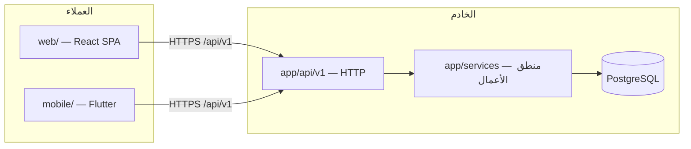
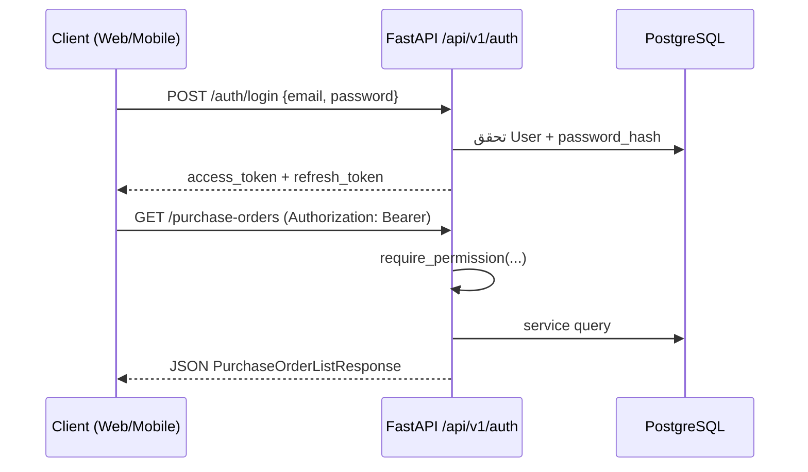

# Mezan — دليل هيكلة الشفرة المصدرية

**الجمهور:** لجنة تحكيم مشروع التخرج / المطورون الجدد  
**التركيز:** Backend (الأولوية)، ثم Web، ثم Mobile، ثم البنية التحتية

---

## فهرس المحتويات

1. [الصورة العامة](#1-الصورة-العامة)
2. [جذر المستودع](#2-جذر-المستودع-mezan)
3. [هيكلة الـ Backend](#3-هيكلة-الـ-backend-app)
4. [أمثلة كود — نفس الفكرة عبر الطبقات](#4-أمثلة-كود--نفس-الفكرة-عبر-الطبقات-أمر-شراء)
5. [هيكلة الـ Web](#5-هيكلة-الـ-web-websrc)
6. [هيكلة الـ Mobile](#6-هيكلة-الـ-mobile-mobilelib)
7. [ربط Web و Mobile بالـ Backend](#7-ربط-web-و-mobile-بالـ-backend)
8. [Docker](#8-docker)
9. [Alembic (ترحيلات قاعدة البيانات)](#9-alembic-ترحيلات-قاعدة-البيانات)
10. [CI/CD](#10-cicd)
11. [خلاصة للإلقاء](#11-خلاصة-للإلقاء)

---

## 1. الصورة العامة

المشروع **monorepo** واحد يحتوي ثلاث واجهات تتصل بنفس REST API:



### قاعدة المعمارية (Backend)

| الطبقة | المجلد | ماذا **يفعل** | ماذا **لا يفعل** |
|--------|--------|---------------|------------------|
| API | `app/api/` | تحقق HTTP، صلاحيات، استدعاء خدمة، audit | قواعد أعمال، SQL معقد |
| Services | `app/services/` | منطق تجاري، معاملات، ترحيل GL | معرفة HTTP headers |
| Models | `app/models/` | تعريف جداول ORM | تحقق مدخلات API |
| Schemas | `app/schemas/` | عقود Pydantic للإدخال/الإخراج | استعلامات DB |
| Core | `app/core/` | إعدادات، أخطاء، rate limit | منطق مجال |
| DB | `app/db/` | محرك async، جلسات | — |
| Utils | `app/utils/` | دوال نقية (مال، أسماء…) | حالة أو DB |

### تدفق طلب واحد (مثال: إنشاء أمر شراء)

```
POST /api/v1/purchase-orders
    → purchase_orders.py (endpoint)
    → purchase_order_service.create_po()
    → models: PurchaseOrder + PurchaseOrderLine
    → commit + audit
    → PurchaseOrderRead (schema) كاستجابة JSON
```

---

## 2. جذر المستودع (`mezan/`)

```
mezan/
├── app/                    # كود Backend (FastAPI)
├── web/                    # واجهة الويب (React + Vite)
├── mobile/                 # تطبيق الجوال (Flutter)
├── alembic/                # ترحيلات PostgreSQL
├── tests/                  # اختبارات pytest
├── docker/                 # Dockerfiles + entrypoint
├── docs/                   # وثائق (هذا الملف وغيره)
├── .github/workflows/      # CI و CD
├── docker-compose.yml      # بيئة تطوير
├── docker-compose.prod.yml # بيئة إنتاج
├── pyproject.toml          # تبعيات Python + إعدادات ruff/pytest
├── alembic.ini             # إعداد Alembic
├── uv.lock                 # قفل تبعيات uv
├── PROJECT_STATE.md        # حالة المشروع (مصدر الحقيقة)
└── README.md               # تشغيل سريع
```

| الملف/المجلد | الوظيفة |
|--------------|---------|
| `pyproject.toml` | تعريف الحزمة، FastAPI، SQLAlchemy، pytest markers |
| `uv.lock` | نسخ محددة من الحزم لبناء قابل للتكرار |
| `.env` / `.env.example` | أسرار وإعدادات (SECRET_KEY، DATABASE_URL…) |
| `PROJECT_STATE.md` | ما بُني، ما نُقص، ما مخطط |

---

## 3. هيكلة الـ Backend (`app/`)

```
app/
├── main.py                 # نقطة دخول FastAPI — routers، middleware، lifespan
├── api/
│   ├── deps.py             # get_current_user، require_permission، get_db
│   ├── error_handlers.py   # تحويل AppError → JSON موحّد
│   └── v1/                 # مسار REST لكل مجال (~50 ملف router)
├── core/
│   ├── config.py           # Settings من متغيرات البيئة
│   ├── errors.py           # AppError، NotFoundError، ValidationError…
│   └── rate_limit.py       # slowapi
├── db/
│   ├── database.py         # async engine + AsyncSessionLocal + Base
│   ├── enum_compat.py      # توافق enums
│   └── schema_check.py     # فحص جاهزية جداول عند الإقلاع
├── models/                 # ~80+ ملف ORM (جدول ≈ ملف)
├── schemas/                # ~60+ ملف Pydantic (مجال ≈ ملف)
├── services/               # ~100+ ملف منطق أعمال
│   ├── ai/                 # مستشارون + LLM
│   ├── notifications/      # جدولة + FCM + مولّدات
│   ├── payments/           # مزودو دفع (in_store، mock)
│   └── ocr/                # مسح فواتير
├── utils/                  # مساعدات نقية
├── scripts/                # seed، backfill، أدوات تشغيل
└── assets/                 # شعار PDF وغيره
```

### 3.1 `app/main.py`

- ينشئ `FastAPI(app)` مع `lifespan` (مهام خلفية: نسخ احتياطي، إشعارات).
- يضيف middleware: `RequestID`، `CORS`.
- يربط static files (صور المنتجات، أفاتار، وثائق هوية).
- يسجّل كل routers تحت `/api/v1`:

```python
app.include_router(purchase_orders_router, prefix="/api/v1", tags=["purchase_orders"])
app.include_router(accounting_router, prefix="/api/v1", tags=["accounting"])
# ... أكثر من 45 router
```

### 3.2 `app/api/v1/` — ملف لكل مجال

| الملف | المسارات التقريبية |
|-------|-------------------|
| `auth.py` | `/auth/login`, `/auth/refresh`, إعادة كلمة المرور |
| `catalog.py` | منتجات، فئات، ضرائب |
| `carts.py` | عربات POS |
| `purchase_orders.py` | أوامر الشراء |
| `accounting.py` | قيود، تقارير مالية |
| `payroll.py` | رواتب ومسيرات |
| `employees.py` | موظفون، حضور |
| `realtime.py` | SSE `/realtime/events` |
| `health.py` | `/health` للمراقبة |

**كل endpoint نموذجي:**

1. `Depends(get_db)` — جلسة DB  
2. `Depends(get_current_user)` — JWT  
3. `require_permission("resource", "action")` — RBAC  
4. استدعاء `service`  
5. `audit_service.log` عند الحاجة  
6. `await db.commit()`  
7. إرجاع `Schema` Pydantic  

### 3.3 `app/api/deps.py`

- **`get_current_user`**: يفك JWT من `Authorization: Bearer` ويحمّل `User`.
- **`require_permission`**: factory يرجع dependency يفحص `(resource, action)` من `effective_permissions`.
- **`user_from_access_token`**: لـ SSE حيث التوكن يمر في query string.

### 3.4 `app/models/` — SQLAlchemy ORM

**قاعدة:** ملف واحد ≈ جدول واحد (أو كيانين مرتبطين closely).

مثال `purchase_order.py`:

```python
class PurchaseOrder(Base):
    __tablename__ = "purchase_orders"

    id: Mapped[int] = mapped_column(Integer, primary_key=True, index=True)
    supplier_name: Mapped[str] = mapped_column(String(255), nullable=False)
    status: Mapped[str] = mapped_column(String(32), default="draft")
    # ForeignKeys → branches, suppliers, users
    lines = relationship("PurchaseOrderLine", back_populates="purchase_order", ...)
```

| ما يُكتب هنا | ما لا يُكتب |
|-------------|------------|
| أعمدة، FK، indexes، relationships | تحقق طلب HTTP |
| `Mapped[...]` types | منطق انتقال الحالة (يذهب للـ service) |

**مجموعات نماذج شائعة:**

- `users.py`, `role.py`, `user_role.py`, `permission.py` — هوية وRBAC  
- `product.py`, `product_variant.py`, `category.py` — كتالوج  
- `pos_cart.py`, `sales_invoice.py` — POS  
- `chart_accounts.py`, `journal_entry.py` — محاسبة  
- `employee_profile.py`, `attendance_log.py` — HR  

### 3.5 `app/schemas/` — Pydantic

**قاعدة:** عقود **خارجية** للـ API — ليست جداول DB.

النمط المتكرر في كل ملف schema:

| النوع | الاستخدام |
|-------|-----------|
| `*Create` | body عند POST |
| `*Update` | body عند PATCH (حقول optional) |
| `*Read` | استجابة GET (غالباً `from_attributes=True`) |
| `*ListResponse` | `{ items, total, limit, offset }` |

مثال حقيقي من `schemas/purchase_orders.py`:

```python
class PurchaseOrderLineCreate(PurchaseOrderLineBase):
    unit_cost: Decimal | None = Field(default=None, ...)

    @field_validator("unit_cost")
    @classmethod
    def _unit_cost_positive_when_set(cls, v: Decimal | None) -> Decimal | None:
        if v is not None and v <= 0:
            raise ValueError("unit_cost must be positive when provided")
        return v


class PurchaseOrderRead(PurchaseOrderBase):
    id: int
    status: str
    lines: list[PurchaseOrderLineRead] = Field(default_factory=list)
    model_config = ConfigDict(from_attributes=True, json_encoders={Decimal: str})
```

**ملاحظات مهمة:**

- `Decimal` يُسلسل كنص في JSON لتجنب أخطاء float.  
- `from_attributes=True` يسمح ببناء الـ schema من ORM object بعد تحميل العلاقات.  
- التحقق هنا **للشكل**؛ قواعد الأعمال العميقة في `services/`.

**ملفات schemas أخرى (نفس الفكرة):**

- `auth.py` — LoginRequest، TokenResponse  
- `catalog.py` — ProductCreate، ProductRead  
- `payroll.py` — PayslipRead  
- `pagination.py` — `PaginatedListResponse[T]` عام  

### 3.6 `app/services/` — منطق الأعمال

**أكبر مجلد في المشروع.** ملف لكل مجال أو عملية فرعية.

مثال `purchase_order_service.py`:

```python
async def _get_po(db: AsyncSession, po_id: int) -> PurchaseOrder:
    result = await db.execute(
        select(PurchaseOrder)
        .options(selectinload(PurchaseOrder.lines))  # تجنّب N+1
        .where(PurchaseOrder.id == po_id)
    )
    po = result.scalar_one_or_none()
    if not po:
        raise NotFoundError("Purchase order not found", details={"po_id": po_id})
    return po
```

| ما يفعله الـ service | أمثلة |
|---------------------|-------|
| التحقق التجاري | `validate_variant_belongs_to_product` |
| آلة حالات | PO: draft → sent → tracked → closed |
| معاملات DB | flush/commit ضمن endpoint أو خدمة أعلى |
| ترحيل GL | `document_posting_service.post_sales_invoice_gl` |
| تكامل خارجي | `ai/llm_client`, `notifications/providers/fcm` |

**خدمات محورية:**

| الملف | الدور |
|-------|-------|
| `accounting_service.py` | `post_journal_entry` — قيد مزدوج |
| `document_posting_service.py` | ربط POS/GR/رواتب → GL |
| `effective_permissions.py` | اتحاد صلاحيات الأدوار |
| `audit_service.py` | سجل تدقيق |
| `cart_service.py` | دورة حياة عربة POS |

### 3.7 `app/core/`

| الملف | المحتوى |
|-------|---------|
| `config.py` | `Settings` عبر `pydantic-settings`: DATABASE_URL، SECRET_KEY، CORS… |
| `errors.py` | `AppError(code, message, http_status, details)` |
| `rate_limit.py` | حدود طلبات (خاصة AI) |

عند رفع `ValidationError` أو `NotFoundError` من service، `error_handlers.py` يحوّلها لـ JSON:

```json
{
  "error": {
    "code": "resource_not_found",
    "message": "...",
    "details": { ... }
  }
}
```

### 3.8 `app/db/database.py`

- `create_async_engine` مع `asyncpg`.  
- `AsyncSessionLocal` — factory للجلسات.  
- `get_db()` — generator يُحقَن في FastAPI.  
- `Base` — كل models ترث منه (لـ Alembic metadata).

### 3.9 `app/utils/`

دوال **بدون حالة** وبدون DB:

- `money.py` — `q2()`, تقريب Decimal  
- `security.py` — hash password، JWT  
- `person_name.py` — تنسيق أسماء عربية  

### 3.10 `app/scripts/`

| السكربت | متى يُشغَّل |
|---------|------------|
| `core_seed.py` | عند إقلاع Docker / يدوياً — أدوار، CoA، قوالب |
| `dev_seed.py` | بيانات تجريبية للتطوير فقط |
| `backfill_product_variants.py` | ترحيل بيانات variants |

---

## 4. أمثلة كود — نفس الفكرة عبر الطبقات (أمر شراء)

### الطبقة 1 — Schema (عقد الإدخال)

```python
# app/schemas/purchase_orders.py
class PurchaseOrderCreate(PurchaseOrderBase):
    lines: list[PurchaseOrderLineCreate] = Field(default_factory=list)
```

### الطبقة 2 — Model (جدول DB)

```python
# app/models/purchase_order.py
class PurchaseOrder(Base):
    __tablename__ = "purchase_orders"
    status: Mapped[str] = mapped_column(String(32), default="draft")
    lines = relationship("PurchaseOrderLine", ...)
```

### الطبقة 3 — Service (المنطق)

```python
# app/services/purchase_order_service.py
async def create_po(db, *, created_by_user_id, data) -> PurchaseOrder:
    await _ensure_products_exist(db, product_ids)
    po = PurchaseOrder(...)
    # إضافة lines، flush، لا commit هنا أحياناً — الـ endpoint يcommit
    return po
```

### الطبقة 4 — API (البوابة)

```python
# app/api/v1/purchase_orders.py
@router.post("/purchase-orders", response_model=PurchaseOrderRead)
async def create_po_endpoint(body: PurchaseOrderCreate, ...):
    po = await create_po(db, created_by_user_id=current_user.id, data=body.model_dump())
    await audit_service.log(...)
    await db.commit()
    return await purchase_order_to_read_one(db, po)
```

> **للجنة:** هذا الفصل يسمح باختبار `create_po` بدون HTTP، وتغيير JSON دون لمس الجداول.

---

## 5. هيكلة الـ Web (`web/src/`)

```
web/src/
├── main.tsx              # bootstrap: providers + RouterProvider
├── App.tsx               # غلاف بسيط (إن وُجد)
├── api/                  # طبقة HTTP مشتركة
│   ├── client.ts         # Axios واحد + interceptors
│   ├── generated/schema.ts  # أنواع مولَّدة من OpenAPI
│   ├── pagination.ts
│   └── interceptors/     # 401 refresh، 403، أخطاء…
├── config/
│   ├── env.ts            # VITE_* variables
│   └── navigation.ts     # شجرة القائمة الجانبية + صلاحيات
├── routes/
│   ├── router.tsx        # كل مسارات التطبيق (lazy)
│   └── guards.tsx        # RequireAuth، RequirePermission
├── features/             # وحدة لكل مجال backend
│   ├── auth/
│   ├── pos/
│   ├── catalog/
│   ├── inventory/
│   ├── purchasing/
│   ├── accounting/
│   ├── hr/
│   ├── payroll/
│   ├── admin/
│   ├── bi/
│   └── ...
├── components/
│   ├── layout/           # AdminLayout، Sidebar، Topbar
│   ├── shared/           # DataTable، Form، PageHeader
│   └── ui/               # shadcn primitives
├── providers/            # Query، Theme، I18n، Realtime (SSE)
├── hooks/                # usePermission، nav badges
├── i18n/                 # ar/en JSON لكل feature
├── lib/                  # مساعدات عامة (مال، أسماء)
└── styles/               # tokens.css + Tailwind
```

### 5.1 `main.tsx` — ترتيب التشغيل

```tsx
<I18nProvider>
  <ThemeProvider>
    <QueryProvider>           {/* TanStack Query */}
      <AuthBoundary>
        <RealtimeProvider>    {/* SSE → invalidation */}
          <RouterProvider router={router} />
```

### 5.2 `api/client.ts` — بوابة HTTP الوحيدة

- `baseURL` من `VITE_API_BASE_URL` (مثلاً `http://localhost:8000/api/v1`).  
- interceptors: توكن، لغة، `request_id`، تجديد 401، تعيين أخطاء موحّدة.  
- **قاعدة:** feature modules تستورد `apiClient` فقط — لا `axios` مباشرة.

### 5.3 نمط `features/<domain>/`

كل مجال يتبع نفس القالب:

```
features/purchasing/
├── api.ts          # دوال: listPurchaseOrders(), createPo()…
├── queries.ts      # queryKeys + useQuery/useMutation
├── pages/          # شاشات كاملة
├── components/     # مكوّنات خاصة بالمشتريات
└── lib/            # حسابات محلية (مثلاً receiveLineProgress)
```

مثال `api.ts`:

```typescript
import { apiClient } from '@/api/client';
import type { components } from '@/api/generated/schema';

export type PurchaseOrderRead = components['schemas']['PurchaseOrderRead'];

export async function listPurchaseOrders(params) {
  const { data } = await apiClient.get('/purchase-orders', { params });
  return data;
}
```

### 5.4 `routes/router.tsx`

- مسارات nested تحت `AdminLayout` أو `AuthLayout`.  
- `lazy(() => import(...))` — تقسيم الحزم.  
- `RequirePermission resource="purchase_orders" action="read"` على المسارات الحساسة.

### 5.5 `config/navigation.ts`

- شجرة القائمة الجانبية.  
- كل عنصر قد يحمل `permission: { resource, action }`.  
- `navigationFilter.ts` يخفي ما لا يملك المستخدم صلاحيته.

### 5.6 مجلدات `features/` الرئيسية

| المجلد | المحتوى |
|--------|---------|
| `auth` | login، reset password، profile، authStore (Zustand) |
| `pos` | ShiftGate، Register، stores محلية، طباعة |
| `catalog` | منتجات، فئات، attributes، taxes |
| `inventory` | مخزون، تحويلات، تعديلات، جرد |
| `purchasing` | موردون، PO، استلام |
| `accounting` | CoA، قيود، تقارير، سندات |
| `hr` / `payroll` | موظفون، حضور، رواتب |
| `admin` | مستخدمون، فروع، terminals، backups |
| `bi` | لوحة تنفيذية |
| `crm` / `marketing` | عملاء، خصومات، حملات |

---

## 6. هيكلة الـ Mobile (`mobile/lib/`)

```
mobile/lib/
├── main.dart                 # نقطة دخول Flutter
├── app/
│   ├── mezan_app.dart        # MaterialApp + theme
│   ├── router.dart           # GoRouter — مسارات
│   └── employee_shell.dart   # shell التبويبات السفلية
├── core/
│   ├── api/
│   │   ├── api_client.dart   # Dio + JWT + refresh
│   │   └── token_storage.dart
│   ├── config/               # AppConfig.apiBaseUrl
│   ├── theme/                # ألوان، خطوط، RTL
│   ├── i18n/                 # نصوص ar/en
│   └── validation/
├── features/
│   ├── auth/                 # login، 2FA، session
│   ├── dashboard/            # الصفحة الرئيسية + QR حضور
│   ├── my_leaves/            # طلبات إجازة
│   ├── payroll/              # مسيرات
│   ├── profile/              # تعديل الملف
│   ├── stock/                # بحث مخزون + barcode
│   ├── notifications/
│   ├── requests/             # مراسلات + feedback
│   └── attendance_kiosk/     # وضع كiosk QR
└── shared/widgets/           # أزرار، بطاقات، حقول مشتركة
```

### 6.1 نمط Feature في Flutter

```
features/payroll/
├── payroll_page.dart         # UI
├── payroll_controller.dart   # ChangeNotifier — حالة الشاشة
├── payroll_repository.dart   # استدعاءات API
└── models/
    └── payslip_read.dart     # تحويل JSON → كائن Dart
```

| الطبقة | المسؤولية |
|--------|-----------|
| **Page** | Widgets، أحداث المستخدم |
| **Controller** | loading/error/data، يستدعي Repository |
| **Repository** | مسارات `/payroll/...` عبر ApiClient |
| **Model** | `fromJson` / حقول typed |

### 6.2 `core/api/api_client.dart`

- `Dio` مع `baseUrl: AppConfig.apiBaseUrl`.  
- interceptor يضيف `Authorization: Bearer`.  
- عند 401: يحاول `/auth/refresh` ثم يعيد الطلب.  
- يحوّل أخطاء FastAPI لـ `ApiException` مع `code` ورسالة.

### 6.3 `AppConfig`

```dart
// افتراضي التطوير:
// Android emulator → http://10.0.2.2:8000/api/v1
// iOS/desktop     → http://127.0.0.1:8000/api/v1
// override: flutter run --dart-define=API_BASE_URL=https://api.example.com/api/v1
```

---

## 7. ربط Web و Mobile بالـ Backend

### 7.1 العقد المشترك — REST + OpenAPI

| العنصر | Backend | Web | Mobile |
|--------|---------|-----|--------|
| Base URL | يستمع `:8000` | `VITE_API_BASE_URL` | `AppConfig.apiBaseUrl` |
| مسارات | `/api/v1/...` | نفس المسارات | نفس المسارات |
| مصادقة | JWT Bearer | header عبر interceptor | header عبر Dio |
| تجديد | `POST /auth/refresh` | interceptor 401 | `_doRefresh()` |
| صلاحيات | server-side RBAC | `GET /auth/me/permissions` + guards | يعتمد على ما يرجعه API |
| أنواع | Pydantic → OpenAPI | `openapi-typescript` | models يدوية/Dart |

### 7.2 مخطط مصادقة



### 7.3 Web — proxy التطوير

في `web/vite.config` (عادة): الطلبات إلى `/api` تُوجَّه إلى `localhost:8000` لتجنب CORS أثناء التطوير.

### 7.4 Web — توليد الأنواع

```bash
cd web && pnpm api:generate
# يقرأ openapi.json → src/api/generated/schema.ts
```

هذا يضمن تطابق TypeScript مع schemas الـ Backend.

### 7.5 Mobile — لا codegen حالياً

- الـ repositories تبني `Map`/`Model` يدوياً من JSON.  
- نفس حقول `*Read` في Pydantic هي المرجع.

### 7.6 Realtime (Web فقط حالياً)

- `GET /api/v1/realtime/events` — SSE.  
- `RealtimeProvider` يبطل cache شارات القائمة — **ليس** WebSocket.

---

## 8. Docker

### 8.1 لماذا Docker؟

- بيئة موحّدة: Python 3.12 + PostgreSQL 15 + نفس entrypoint.  
- فصل dev/prod عبر Dockerfiles مختلفة.  
- `depends_on` + healthcheck يضمن أن API ينتظر DB.

### 8.2 ملفات Docker

| الملف | الغرض |
|-------|-------|
| `docker-compose.yml` | **تطوير:** db + api (reload) + mailpit + pgadmin اختياري |
| `docker-compose.prod.yml` | **إنتاج:** db + api فقط، حدود موارد |
| `docker/Dockerfile.dev` | صورة تطوير مع hot reload |
| `docker/Dockerfile.prod` | multi-stage: builder (uv sync) → runtime slim |
| `docker/Dockerfile.staging` | مشابه prod لفرع staging |
| `docker/entrypoint.sh` | انتظار DB → `alembic upgrade head` → `core_seed` → تشغيل uvicorn |

### 8.3 تدفق الإقلاع (Production)

```
docker compose -f docker-compose.prod.yml up
    → container db (postgres:15)
    → container api:
         entrypoint.sh
           1. nc -z db:5432
           2. alembic upgrade head
           3. python -m app.scripts.core_seed
           4. uvicorn app.main:app
```

### 8.4 خدمات dev (`docker-compose.yml`)

| Service | Port | الوظيفة |
|---------|------|---------|
| `db` | 5432 | PostgreSQL |
| `api` | 8000 | FastAPI + `--reload` |
| `mailpit` | 8025 UI | اختبار بريد reset password |

### 8.5 Dockerfile.prod (مختصر)

1. **Stage builder:** `uv sync --locked --no-dev` — تثبيت التبعيات.  
2. **Stage runtime:** نسخ `.venv` + `app/` فقط — صورة صغيرة بدون أدوات بناء.

---

## 9. Alembic (ترحيلات قاعدة البيانات)

### 9.1 ما هو Alembic؟

أداة **إصدارات مخطط DB**: كل تغيير في الجداول = ملف migration في `alembic/versions/`.

### 9.2 الملفات

| الملف | الدور |
|-------|-------|
| `alembic.ini` | إعدادات: `script_location = alembic` |
| `alembic/env.py` | يربط `Base.metadata` بكل models عبر `import app.models` |
| `alembic/versions/*.py` | ترقيات/تراجعات (`upgrade` / `downgrade`) |
| `alembic/script.py.mako` | قالب ملف migration جديد |

### 9.3 كيف يعمل `env.py`

```python
import app.models  # noqa — تسجيل كل الجداول على Base.metadata
target_metadata = Base.metadata

# يستخدم settings.database_url_async (postgresql+asyncpg://...)
```

### 9.4 سير العمل المعتاد

```bash
# بعد تعديل model في app/models/
uv run alembic revision --autogenerate -m "وصف التغيير"
uv run alembic upgrade head          # تطبيق على DB
uv run alembic downgrade -1          # تراجع خطوة (بحذر)
uv run alembic check                 # هل models تطابق DB؟ (يُستخدم في CI)
```

### 9.5 CI يفحص الانجراف

في `.github/workflows/ci.yml`:

```yaml
uv run alembic upgrade head
uv run alembic check   # يفشل إذا نسيت migration
```

### 9.6 علاقة Models ↔ Migrations

- **Models** = الحقيقة في الكود Python.  
- **Migrations** = تاريخ تطبيق التغيير على PostgreSQL الإنتاجي.  
- لا تعدّل جداول prod يدوياً — دائماً عبر Alembic.

---

## 10. CI/CD

### 10.1 CI — Continuous Integration (`.github/workflows/ci.yml`)

**متى:** push أو PR على `main` / `develop`.

| الخطوة | ماذا تفعل |
|--------|-----------|
| Checkout | سحب الكود |
| setup-uv + Python 3.12 | بيئة |
| `uv sync --dev` | تثبيت |
| `ruff format --check` | تنسيق |
| `ruff check` | lint |
| `alembic upgrade head` + `alembic check` | اتساق DB |
| `pytest -m "core or security"` | اختبارات محاسبة + أمان |
| `docker build -f docker/Dockerfile.dev` | التحقق من بناء الصورة |

**خدمة postgres** مؤقتة في GitHub Actions لاختبارات حقيقية على DB.

### 10.2 CD — Continuous Deployment (`.github/workflows/cd.yml`)

**متى:** push على `main` (prod) أو `staging`.

| Job | الإجراء |
|-----|---------|
| `build-and-push` | بناء Docker image ودفعها إلى `ghcr.io` |
| `deploy-staging` | placeholder لأوامر نشر staging |
| `deploy-production` | placeholder لأوامر نشر production |

> خطوات النشر الفعلية (SSH، kubectl…) موثّقة كـ placeholder — الصورة تُبنى وتُرفع تلقائياً.

### 10.3 الفرق بين CI و CD

| | CI | CD |
|--|----|----|
| الهدف | جودة الكود قبل الدمج | توصيل نسخة قابلة للتشغيل |
| الناتج | تقرير نجاح/فشل | Docker image في registry |
| يمنع merge؟ | نعم (إن فُعّل branch protection) | — |

---

## 11. خلاصة للإلقاء

> نظّمنا Mezan كـ monorepo: Backend بأربع طبقات صارمة (`api` → `services` → `models` + `schemas`)، وواجهة Web بمجلد `features/` يطابق مجالات الـ API، وتطبيق Flutter بنمط Page/Controller/Repository. الجميع يتكلم REST على `/api/v1` مع JWT وRBAC من الخادم. PostgreSQL يُدار بـ Alembic، والتشغيل بـ Docker Compose، والجودة بـ GitHub Actions (ruff + pytest + alembic check + build).

---

## مراجع داخل المستودع

| الوثيقة | المحتوى |
|---------|---------|
| [PROJECT_STATE.md](../PROJECT_STATE.md) | Epics وحالة التنفيذ |
| [GRADUATION_PROJECT_OVERVIEW_AR.md](./GRADUATION_PROJECT_OVERVIEW_AR.md) | فكرة المشروع والنطاق |
| [SYSTEM_ROLES_ACCESS.md](./SYSTEM_ROLES_ACCESS.md) | RBAC والأدوار |
| [README.md](../README.md) | أوامر التشغيل السريع |

---

*آخر تحديث: يونيو 2026*
