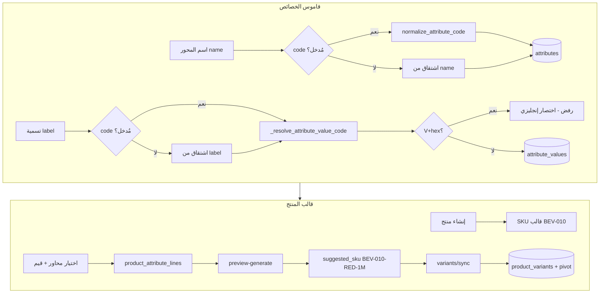

# سير عمل خصائص المنتجات والمتغيرات (Product Attributes & Variants)

هذا المستند يشرح **سير العمل الكامل** في نظام Mezan: من إنشاء محور الخاصية (Attribute) وقيمه في القاموس العام، إلى ربطها بقالب المنتج وتوليد متغيرات (Variants) ورموز SKU.  
يركز على **الفصل بين الاسم المعروض للمستخدم والرمز البرمجي** الذي يُستخدم في التكامل والمخزون وPOS.

> **ملاحظة:** نظام «خصائص الفئة» القديم أُزيل. لا توجد خصائص مرتبطة بالتصنيف ولا يوجد حقل `products.attributes`؛ كل محاور المنتج تأتي من القاموس العالمي (`attributes` / `attribute_values`) وتُربط مباشرة بقالب المنتج.

---

## 1. المفاهيم الأساسية

| المستوى | الاسم المعروض (UI / تقارير) | الرمز البرمجي (Key / Slug) | الجدول |
|--------|------------------------------|----------------------------|--------|
| **محور الخاصية** | `name` — مثل «اللون» | `code` — مثل `COLOR` | `attributes` |
| **قيمة الخاصية** | `label` — مثل «أحمر» | `code` — مثل `RED` | `attribute_values` |
| **قالب المنتج** | `products.name` | `products.sku` — يُولَّد تلقائياً | `products` |
| **متغير المنتج** | `display_label` — مثل «عصير برتقال — أحمر — 1 لتر» | `product_variants.sku` (رمز النظام، للقراءة فقط) | `product_variants` |
| **رمز الصنف (تتبع)** | يُدخله المستخدم في الواجهة | `product_variants.reference_code` — فريد، اختياري | `product_variants` |
| **باركود المتغير** | EAN-13 داخلي | `product_variants.barcode` — بادئة `201` + `variant_id` | `product_variants` |

> **باركود المنتج (`products.barcode`):** مُهمَل — لا يُعرض في واجهة المنتج العام ولا يُخصَّص تلقائياً. الباركود الوظيفي للمخزون وPOS والشراء على مستوى المتغير فقط.

### لماذا يوجد حقلان؟

- **الاسم/التسمية (`name` / `label`):** عربي أو إنجليزي، للعرض في الواجهة، الفواتير، وملصقات المتغير.
- **الرمز (`code`):** ASCII فقط، مستقر عبر اللغات، يُستخدم في:
  - بناء **SKU الذكي** للمتغيرات.
  - كاش عرض المتغير: `product_variants.attribute_values[attr.code] = val.label`.
  - الفرز والتطابق البرمجي (لا يتغير عند تعديل التسمية العربية).

يمكن تعديل `code` عبر `PATCH` **طالما لم يُستخدم** المحور أو القيمة على أي منتج (خط قالب `product_attribute_lines` / `product_attribute_line_values` أو متغير `product_variant_attributes`). بعد الاستخدام يُقفل الرمز ويبقى التسمية (`name` / `label`) قابلة للتعديل.

---

## 2. طبقة التطبيع: من النص إلى رمز

المنطق المركزي في `app/utils/attribute_code.py` و `app/utils/smart_sku.py`.

### 2.1 `normalize_attribute_code(raw)`

يُطبَّق على الرمز الصريح أو يُشتق من الاسم/التسمية عند غياب الرمز:

1. إزالة المسافات الزائدة.
2. تطبيع Unicode (NFKD).
3. الإبقاء على `A–Z`, `a–z`, `0–9` (تحويل للأحرف الكبيرة) والشرطات من `-_ `.
4. إذا لم يبقَ أي حرف لاتيني/رقم (مثلاً «أحمر» فقط): توليد رمز احتياطي `V` + 12 حرف hex من SHA-256، مثل `V1A2B3C4D5E6`.

```python
# مثال مبسّط من attribute_code.py
normalize_attribute_code("Red")      # → "RED"
normalize_attribute_code("أحمر")     # → "V1A2B3C4D5E6" (غير صالح لـ SKU)
```

### 2.2 قواعد أشد لقيم الخصائص (`_resolve_attribute_value_code`)

عند **إنشاء قيمة** في `attribute_service.py`:

| الحالة | السلوك |
|--------|--------|
| المستخدم أدخل `code` صريحاً | يُطبَّع ثم يُفحص |
| الحقل فارغ | يُشتق من `label` عبر `normalize_attribute_code` |
| الناتج يطابق `V[A-F0-9]{12}` | **رفض** — يجب إدخال اختصار إنجليزي (RED, 1M, 5KG) |
| الناتج لا يمر `normalize_sku_segment` | **رفض** — أحرف وأرقام إنجليزية فقط |

هذا يمنع إنشاء قيم عربية-only بدون رمز SKU صالح، لأن المتغيرات تعتمد على `code` في الرمز النهائي.

### 2.3 شرائح SKU (`normalize_sku_segment` / `sku_segment_key`)

- أحرف كبيرة A–Z وأرقام 0–9 فقط.
- **حد أقصى 5 أحرف** لكل شريحة في SKU المتغير (`SKU_SEGMENT_MAX = 5`؛ الرمز الكامل في DB حتى 64).
- عند **إنشاء أو تعديل** قيمة: `_assert_unique_sku_segment_within_attribute` يرفض رموزاً تصبح شرائحها متطابقة مع قيمة أخرى على نفس المحور (مثال: `BLACK` و`BLACKBERRY` → كلاهما `BLACK`).

---

## 3. المرحلة 1: قاموس الخصائص العام (Master Data)

**المسار في الواجهة:** `الكتالوج → الخصائص` (`/catalog/attributes`)  
**الملف:** `web/src/features/catalog/pages/attributes/AttributesPage.tsx`  
**API:** `GET/POST/PATCH/DELETE /api/v1/catalog/attributes` و `/values`

### 3.1 إنشاء محور خاصية (Attribute)

| الخطوة | الواجهة | الحقل في API | الخادم |
|--------|---------|--------------|--------|
| 1 | **اسم الخاصية** (`attr_catalog_name`) | `name` (مطلوب) | `name.strip()` |
| 2 | **الرمز (اختياري)** (`attr_catalog_code`) | `code` أو `null` | `code = body.code or normalize_attribute_code(body.name)` |
| 3 | حفظ | `POST /catalog/attributes` | فحص تفرد `code` عالمياً (`uq_attributes_code`) |

**أمثلة:**

| name (معروض) | code (مُدخل) | code (مُخزَّن) |
|--------------|--------------|----------------|
| اللون | (فارغ) | `LLWN` أو مشتق من الأحرف اللاتينية في الاسم إن وُجدت |
| Size | (فارغ) | `SIZE` |
| اللون | `COLOR` | `COLOR` |

> تلميح الواجهة: «اختصار إنجليزي — لا تستخدم العربية في الرمز».

### 3.2 إضافة قيمة لمحور (Attribute Value)

| الخطوة | الواجهة | API | الخادم |
|--------|---------|-----|--------|
| 1 | **تسمية القيمة** (`value_label`) | `label` | معروض للمستخدم |
| 2 | **اختصار الرمز** (`value_code`) | `code` أو `null` | `_resolve_attribute_value_code` |
| 3 | حفظ | `POST .../attributes/{id}/values` | تفرد `(attribute_id, code)` |

**أمثلة:**

| label | code (مُدخل) | النتيجة |
|-------|--------------|---------|
| أحمر | `RED` | ✓ `code=RED` |
| 1 لتر | `1M` | ✓ |
| أحمر | (فارغ) | ✗ إذا اشتُق `V…` — خطأ يطلب اختصاراً إنجليزياً |
| Red | (فارغ) | ✓ `RED` |

### 3.3 التعديل والدمج

- **تعديل المحور:** `PATCH` — `name`, `code` (إن `usage_count === 0`), `sort_order`, `metadata`.
- **تعديل القيمة:** `PATCH` — `label`, `code` (إن `usage_count === 0`).
- **قفل الرمز:** `ConflictError` مع `details.code = "code_locked"` عند محاولة تغيير `code` بعد الربط بمنتج.
- **دمج قيم مكررة:** `POST .../values/merge` — يوحّد المراجع في خطوط المنتج والمتغيرات نحو `target_value_id`.

عرض القائمة: كل صف يظهر **الاسم بخط عريض** و**الرمز بخط monospace** (`dir="ltr"`).

---

## 4. المرحلة 2: ربط الخصائص بقالب المنتج

**المسار:** تحرير منتج → تبويب **«الخصائص والمتغيرات»**  
**المكوّنات:**

- `ProductVariantAxesEditor.tsx` — محاور + قيم
- `CatalogAttributeCreatableSelect` — اختيار/إنشاء محور من الصفحة
- `CatalogAttributeValueCreatableMultiSelect` — اختيار/إنشاء قيم متعددة
- `AttributeValueCodeDialog` — طلب الرمز الإنجليزي عند إنشاء تسمية عربية من صفحة المنتج
- `ProductVariantsGrid.tsx` — شبكة المتغيرات بعد الحفظ

### 4.1 هيكل البيانات على المنتج

```
Product (قالب)
├── product_attribute_lines     ← محور واحد لكل سطر (مثلاً اللون)
│   └── product_attribute_line_values  ← القيم المسموحة على هذا القالب (أحمر، أزرق)
└── product_variants            ← تركيبة فعلية للبيع/المخزون
    └── product_variant_attributes (pivot)  ← مصدر الحقيقة: value_id لكل محور
```

- **خط المحور (`ProductAttributeLine`):** يحدد *أي* خصائص يستخدمها المنتج و*أي قيم* مسموحة.
- **المتغير (`ProductVariant`):** تركيبة واحدة من قيمة لكل محور (حاصل ضرب декартي).

### 4.2 إضافة محور على المنتج

1. **إضافة سطر محور** → اختيار خاصية من القاموس (أو إنشاء سريع بـ `name` فقط → الخادم يشتق `code`).
2. لكل محور: اختيار **قيم متعددة** من القائمة، أو **إنشاء قيمة جديدة** من البحث:
   - تسمية إنجليزية تُشتق تلقائياً (`Red` → `RED`) ويُرسل الطلب مباشرة.
   - تسمية عربية أو تصادم شرائح SKU → نافذة `AttributeValueCodeDialog` لإدخال `label` + `code` (مثل `YEL` لـ «أصفر»).
3. لا يُسمح بتكرار نفس `attribute_id` في سطرين.

الحالة المحلية في الواجهة:

```ts
type VariantAxisLine = {
  attributeId: number;
  selectedValueIds: number[];
};
```

### 4.3 معاينة عدد المتغيرات

قبل الحفظ، الواجهة تحسب **حاصل الضرب** لعدد القيم على كل محور (`cartesianVariantCount`) وتعرض شارة العدد.  
الخادم يولّد نفس المنطق عبر `cartesian_product_combos` في `variant_combinator.py`.

---

## 5. المرحلة 3: SKU على مستوى القالب والمتغير

### 5.1 SKU القالب (Product)

عند **إنشاء منتج** بدون SKU يدوي (`catalog_service.create_product`):

1. يُخزَّن مؤقتاً `__AUTO…__`.
2. بعد `flush` ومعرف المنتج:  
   `prefix = category_slug_to_prefix(category.slug)` — مثل `beverages` → `BEV`  
   `product.sku = format_product_sku(prefix, product.id)` — مثل `BEV-010`.

| slug الفئة | product.id | SKU القالب |
|------------|------------|------------|
| beverages | 10 | `BEV-010` |
| beverages | 1000 | `BEV-1000` |

### 5.2 SKU المقترح للمتغير (Smart SKU)

عند `POST /products/{id}/variants/preview-generate`:

1. التحقق من المحاور (`validate_catalog_axes`).
2. ترتيب المحاور حسب `CatalogAttribute.sort_order` ثم `id`.
3. لكل تركيبة (حاصل ضرب): جمع `value_code` مرتبة بـ `(attribute_code, value_code)`.
4. `suggested_sku = format_variant_sku(product.sku, codes)`.

**مثال:**

| product.sku | محاور | suggested_sku |
|-------------|--------|---------------|
| `BEV-010` | COLOR=RED, SIZE=1M | `BEV-010-RED-1M` |
| `BEV-010` | COLOR=red (يُقطع لـ4) | `BEV-010-RED` |

**التسمية المعروضة للمتغير** (ليست SKU):

```text
{display_label} = "{product.name} — {label1} — {label2}"
مثال: "عصير برتقال — أحمر — 1 لتر"
```

### 5.3 حفظ المتغيرات

عند حفظ نموذج المنتج (`ProductFormPage` → `saveM`):

1. إنشاء/تحديث المنتج (بيانات أساسية + خصائص الفئة JSON).
2. إن وُجدت محاور:  
   - `previewGenerateVariants(productId, axesPayload)`  
   - `mergePreviewWithDraftRows` — يحافظ على SKU المُعدَّل يدوياً إن وُجد، وإلا يأخذ `suggested_sku`  
   - `syncProductVariants` مع `axes` + `variants[]`
3. إن لم تُعرَّف محاور: `sync` بقائمة فارغة → متغير افتراضي واحد (`_default`).

كل متغير يُخزَّن:

- `sku` — يُتحقق منه بـ `validate_sku_reference` (A–Z, 0–9, شرطات، حتى 128 حرفاً).
- `combination_key` — مفتاح التركيبة الداخلي.
- pivot `product_variant_attributes` — مصدر الحقيقة.
- `attribute_values` JSONB — كاش: `{ "COLOR": "أحمر", "SIZE": "1 لتر" }` (مفتاح = `attr.code`, قيمة = `label`).

### 5.4 التفعيل والأرشفة (`active`)

| `product_variants.active` | المعنى | أين يظهر |
|---------------------------|--------|----------|
| `true` | متغير **مفعّل** — للبيع والاستلام والمخزون | شبكة المتغيرات في صفحة المنتج؛ `GET /product-variants/search?product_id=` |
| `false` | متغير **مؤرشف** — رمز قديم بعد تغيير الخصائص أو إيقاف التفعيل | قسم «متغيرات مؤرشفة» المطوي في صفحة المنتج فقط |

**أرشفة تلقائية:** عند `variants/sync`، أي متغير موجود للمنتج وتركيبته **ليست** ضمن القائمة المرسلة يُعطَّل (`active=false`) ما لم يكن له مخزون أو حركات (يُرفض التعطيل برسالة خطأ).

**استلام أمر الشراء:** قائمة المتغير تستخدم البحث `product-variants/search` مع `product_id` — **المفعّل فقط**. الخادم يرفض `variant_id` غير مفعّل في `validate_variant_belongs_to_product`.

**حفظ مزدوج:** الواجهة تعطّل زر الحفظ أثناء الطلب وتعيد تحميل المتغيرات من `GET .../with-variants` بعد النجاح؛ الخادم يطابق التركيبة بـ `combination_key` قبل الإنشاء لتفادي تكرار نفس الخصائص.

---

## 6. مخطط تدفق شامل (Mermaid)



---

## 7. جدول مرجعي: أين يُستخدم كل حقل؟

| الحقل | يظهر للمستخدم | يدخل SKU | يُحدَّث لاحقاً | فريد |
|-------|---------------|----------|----------------|------|
| `attributes.name` | ✓ | ✗ | ✓ | ✗ |
| `attributes.code` | ✓ (ثانوي) | ✗ (لكن مفتاح JSONB) | ✗ | ✓ عالمياً |
| `attribute_values.label` | ✓ | ✗ | ✓ | ✗ |
| `attribute_values.code` | ✓ (ثانوي) | ✓ (شرائح حتى 4) | ✗ | ✓ ضمن المحور |
| `products.name` | ✓ | ✗ | ✓ | ✗ |
| `products.sku` | ✓ | قاعدة المتغير | نادراً | ✓ |
| `product_variants.sku` | ✓ | ✓ كامل | ✓ | ✓ |
| `display_label` | ✓ | ✗ | مشتق | ✗ |

---

## 8. نقاط API الرئيسية

| العملية | Method | Path |
|---------|--------|------|
| قائمة الخصائص | GET | `/api/v1/catalog/attributes` |
| إنشاء خاصية | POST | `/api/v1/catalog/attributes` |
| قيم محور | GET/POST | `/api/v1/catalog/attributes/{id}/values` |
| منتج + متغيرات | GET | `/api/v1/products/{id}/with-variants` |
| معاينة SKU | POST | `/api/v1/products/{id}/variants/preview-generate` |
| مزامنة متغيرات | POST | `/api/v1/products/{id}/variants/sync` |

**جسم معاينة/مزامنة المحاور:**

```json
{
  "axes": {
    "10": [101, 102],
    "20": [201]
  }
}
```

المفتاح = `attribute_id`، القيمة = مصفوفة `attribute_value_id`.

---

## 9. قيود وسلوكيات مهمة

1. **العربية في الرمز:** مسموحة في `name`/`label` فقط؛ الرموز يجب أن تبقى ASCII للـ SKU والتكامل.
2. **إنشاء قيمة من صفحة المنتج:** التسمية العربية-only تفتح حواراً لإدخال الرمز الإنجليزي؛ لا حاجة للانتقال إلى صفحة الخصائص.
3. **تغيير تركيبة متغير له حركة مخزون:** مرفوض (`ConflictError`) لحماية السجلات.
4. **إزالة متغير من الطلب:** يُعطَّل (`active=false`) ما لم يكن له مخزون.
5. **لا توجد خصائص فئة:** التصنيفات تنظّم المنتجات فقط؛ الخصائص والقيم تُدار عالمياً من `/catalog/attributes` ثم تُختار داخل تبويب خصائص المنتج.

---

## 10. تصدير الباركودات وواجهة المتغيرات

| الحقل في الواجهة | العمود | السلوك |
|------------------|--------|--------|
| رمز النظام | `product_variants.sku` | يُحسب من `products.sku` + رموز قيم المحاور؛ للقراءة فقط |
| رمز الصنف | `product_variants.reference_code` | يُدخله المستخدم؛ فريد عند التعبئة؛ يُستخدم في البحث والتقارير |
| الباركود | `product_variants.barcode` | EAN-13 داخلي (`201` + `variant_id` + checksum)؛ للقراءة فقط |

- **توليد الناقص:** `POST /api/v1/products/{id}/variants/generate-barcodes`
- **تصدير CSV (Excel):** `GET /api/v1/products/{id}/variants/barcode-export?active_only=true` — UTF-8 BOM، أعمدة: `variant_label`, `system_sku`, `reference_code`, `barcode`, `active`

---

## 11. ملفات الكود المرجعية

| الموضوع | المسار |
|---------|--------|
| تطبيع الرمز | `app/utils/attribute_code.py` |
| SKU الذكي | `app/utils/smart_sku.py` |
| خدمة الخصائص | `app/services/attribute_service.py` |
| متغيرات المنتج | `app/services/variant_attribute_service.py` |
| إنشاء SKU القالب | `app/services/catalog_service.py` (`create_product`) |
| مخططات API | `app/schemas/attributes.py`, `app/schemas/variant_generation.py` |
| واجهة القاموس | `web/src/features/catalog/pages/attributes/AttributesPage.tsx` |
| واجهة المنتج | `web/src/features/catalog/pages/products/ProductFormPage.tsx` |
| حوار رمز القيمة | `web/src/features/catalog/components/AttributeValueCodeDialog.tsx` |
| قواعد الرمز (واجهة) | `web/src/features/catalog/lib/attributeValueCode.ts` |
| اختبارات SKU | `tests/test_smart_sku.py` |
| اختبارات رمز الصنف/الباركود | `tests/test_variant_reference_and_barcode.py` |

---

*آخر مراجعة للكود: مايو 2026 — متوافق مع بنية variant attribute pivot وSmart SKU ورمز الصنف.*
